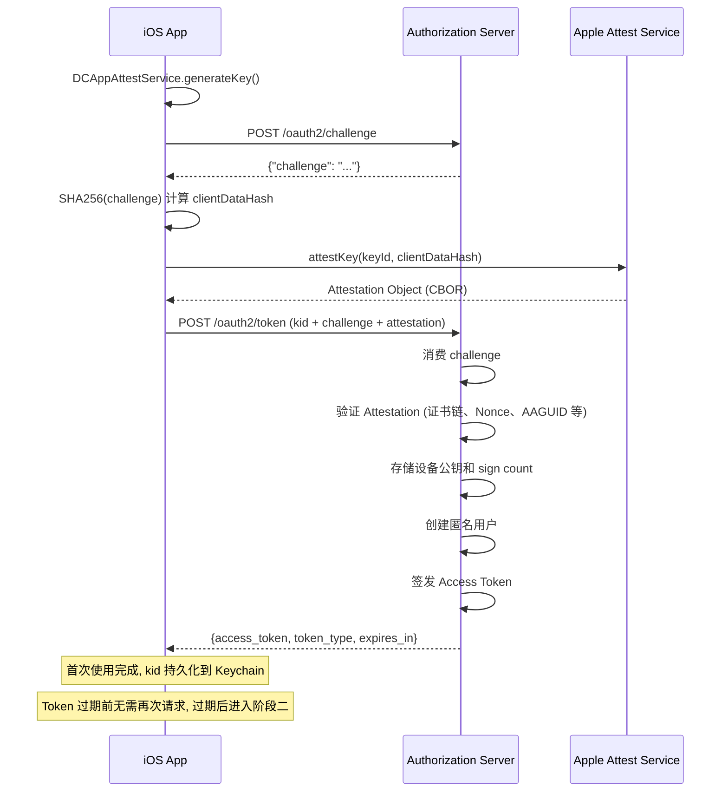
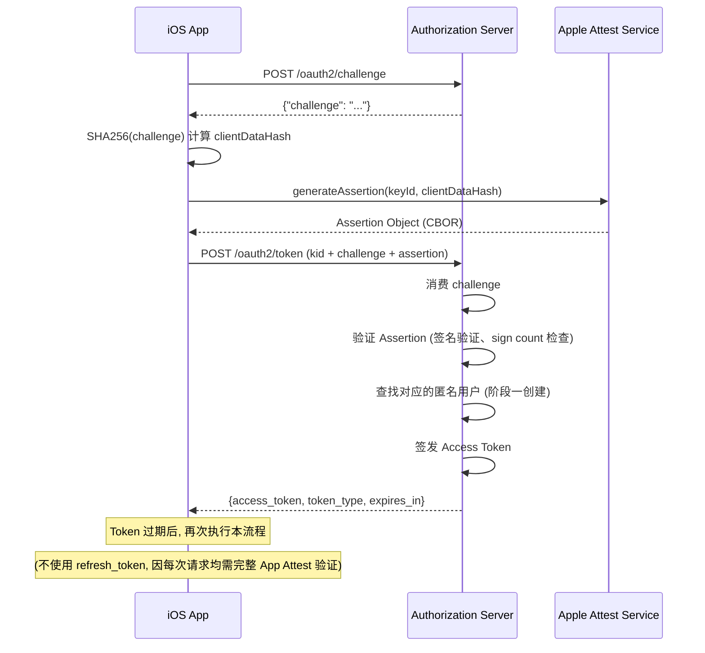

# Apple App Attest 接入文档

本文档描述 Apple Native App 如何利用 [Apple App Attest](https://developer.apple.com/documentation/devicecheck/establishing-your-app-s-integrity) 能力, 通过 `/oauth2/token` 端点一步完成设备注册与 OAuth2 Token 签发, 实现无账号登录并获取用户级 OAuth2 Token.

整个流程只围绕 OAuth2 Token 端点进行, 无需独立的设备注册接口:

1. **首次使用**: 使用 `Attestation` 向 `/oauth2/token` 证明设备合法性, 服务端在同一次请求中完成公钥注册、匿名用户创建, 并直接签发 Access Token.
2. **后续使用**: 使用 `Assertion` 向 `/oauth2/token` 证明设备合法性, 服务端签发 Access Token.

> 本方案基于 `OAuth 2.0 Attestation-Based Client Authentication` 草案规范, 结合 `Apple App Attest` 的 `Attestation` / `Assertion` 两种证明方式作为客户端身份证明.

> **安全须知**: 所有敏感数据 (Key ID、Token 等) 均应使用 Keychain 存储,
> **切勿**使用 `UserDefaults`、`plist` 或其他明文方式存储任何敏感信息, 因为这些存储方式在越狱设备上可被轻易读取.

---

## 统一接口: `POST /oauth2/token`

无论首次使用还是后续使用, 客户端都只请求 `/oauth2/token` 一个端点, 仅 `attestation` / `assertion` 参数的携带方式不同:

| 场景     | 必填参数                                           |
| -------- | -------------------------------------------------- |
| 首次使用 | `grant_type`, `kid`, `challenge`, **`attestation`** |
| 后续使用 | `grant_type`, `kid`, `challenge`, **`assertion`**   |

**请求头:**

| 头部                           | 值                | 说明                                         |
| ------------------------------ | ----------------- | -------------------------------------------- |
| `OAuth-Client-Attestation-Type` | `apple_app_attest` | 指定使用 Apple App Attest 作为客户端证明方式 |
| `Content-Type`                 | `application/x-www-form-urlencoded` | 请求体编码                                   |

**请求体通用参数:**

| 参数名      | 类型   | 说明                                                                 | 是否必填 |
| ----------- | ------ | -------------------------------------------------------------------- | -------- |
| grant_type  | enum   | 固定为 `urn:ietf:params:oauth:grant-type:app_assertion`              | 是       |
| kid         | string | `DCAppAttestService.generateKey()` 生成的 Key Identifier             | 是       |
| challenge   | string | 从 `/oauth2/challenge` 获取的原始 challenge 值                       | 是       |
| attestation | string | Base64 编码的 Attestation Object; **仅首次使用时携带**               | 条件必填 |
| assertion   | string | Base64 编码的 Assertion Object; **后续使用时携带**                   | 条件必填 |
| scope       | string | 申请的权限范围, 多个用空格分隔                                       | 否       |

> 若同时携带 `attestation` 与 `assertion`, 服务端仅校验 `attestation`, `assertion` 会被忽略.

---

## 阶段一: 首次使用 (Attestation)

仅在 App 首次运行或重新生成 Key 时执行一次.

> 使用标准的 `Apple App Attest` 的 `Attestation` 流程: 客户端同时提供自身公钥以及公钥的合法性证明, 服务端验证公钥合法后记录公钥信息, 为该客户端创建一个匿名用户, **并在同一次请求中**签发 Access Token.

### 1.1 获取 Challenge

```http
POST /oauth2/challenge
```

无需认证, 无需请求体.

**Response:**

```json
{"challenge": "dGhpcyBpcyBhIHJhbmRvbSBjaGFsbGVuZ2U"}
```

### 1.2 生成 Attestation

客户端调用 Apple API 生成 Attestation Object:

```swift
let challengeData = Data(SHA256.hash(data: challenge.data(using: .utf8)!))
let attestation = try await DCAppAttestService.shared.attestKey(keyId, clientDataHash: challengeData)
```

### 1.3 请求 Token

```http
POST /oauth2/token
OAuth-Client-Attestation-Type: apple_app_attest
Content-Type: application/x-www-form-urlencoded

grant_type=urn:ietf:params:oauth:grant-type:app_assertion&kid={keyId}&challenge={challenge}&attestation={Base64编码的Attestation Object}&scope=openid
```

**Success Response (200):**

```json
{
    "access_token": "eyJ...",
    "token_type": "Bearer",
    "expires_in": 299
}
```

> Token 响应格式详见 [OAuth2 Token 接口文档](APIs-%23-OAuth2-Grant.md#response)

**Error Response (401):**

```json
{"error": "invalid_client", "error_description": "..."}
```

> 首次使用成功后, App 应在 Keychain 中持久化 `kid`, 后续请求复用.

---

## 阶段二: 后续使用 (Assertion)

首次注册成功后, 每次需要 Access Token 时执行.

> 使用 `Apple App Attest` 的 `Assertion` 流程: 客户端用首次注册时的私钥对 challenge 签名, 服务端使用已存储的公钥完成验证并签发 Token.

### 2.1 获取 Challenge

```http
POST /oauth2/challenge
```

无需认证, 无需请求体.

**Response:**

```json
{"challenge": "dGhpcyBpcyBhIHJhbmRvbSBjaGFsbGVuZ2U"}
```

### 2.2 生成 Assertion

客户端调用 Apple API 生成 Assertion Object:

```swift
let challengeData = Data(SHA256.hash(data: challenge.data(using: .utf8)!))
let assertion = try await DCAppAttestService.shared.generateAssertion(keyId, clientDataHash: challengeData)
```

### 2.3 请求 Token

```http
POST /oauth2/token
OAuth-Client-Attestation-Type: apple_app_attest
Content-Type: application/x-www-form-urlencoded

grant_type=urn:ietf:params:oauth:grant-type:app_assertion&kid={keyId}&challenge={challenge}&assertion={Base64编码的Assertion Object}&scope=openid
```

**Success Response (200):**

```json
{
    "access_token": "eyJ...",
    "token_type": "Bearer",
    "expires_in": 299
}
```

### 2.4 续期 Token

该 Grant Type 不签发 `refresh_token`. Token 过期后直接重新执行 2.1 到 2.3 的 Assertion 流程申请新 Token (获取 challenge → 生成 Assertion → 请求 Token).

> 原因: 每次请求 `/oauth2/token` 接口都需要携带 `Attestation-Based Client Authentication` 要求的请求头证明客户端身份, `refresh_token` 无法提供额外的安全价值, 反而增加存储和验证开销.

---

## 时序图

> 阶段一与阶段二在时间上并不连续: 首次使用完成后, 只要 `access_token` 仍在有效期内, App 无需再次请求 `/oauth2/token`; Token 过期 (可能在数小时或数天之后) 才会进入阶段二.

### 阶段一: 首次使用 (Attestation, 仅首次)



### 阶段二: 后续使用 (Assertion, 每次 Token 过期后)



---

## 注意事项

* 每个 challenge 只能使用一次, 有效期 5 分钟, 过期或已使用的 challenge 会被拒绝.
* `access_token` 过期后应重新执行阶段二 Assertion 流程获取新 Token.
* 阶段一仅在首次使用或重新生成 Key 时执行, App 应在 Keychain 中持久化 `kid`.
* 若同一次请求同时携带 `attestation` 与 `assertion`, 服务端仅校验 `attestation`.
* 如果设备密钥丢失或需要重新注册, 需重新执行完整的阶段一流程.
* **重要!!** 重新执行阶段一 Attestation 后会创建新的匿名用户, 原用户数据无法继续使用.

## 相关文档

* [Establishing Your App's Integrity](https://developer.apple.com/documentation/devicecheck/establishing-your-app-s-integrity)
* [Validating Apps That Connect to Your Server](https://developer.apple.com/documentation/devicecheck/validating-apps-that-connect-to-your-server)
* [OAuth 2.0 Attestation-Based Client Authentication (Draft)](https://datatracker.ietf.org/doc/html/draft-ietf-oauth-attestation-based-client-auth-08)
