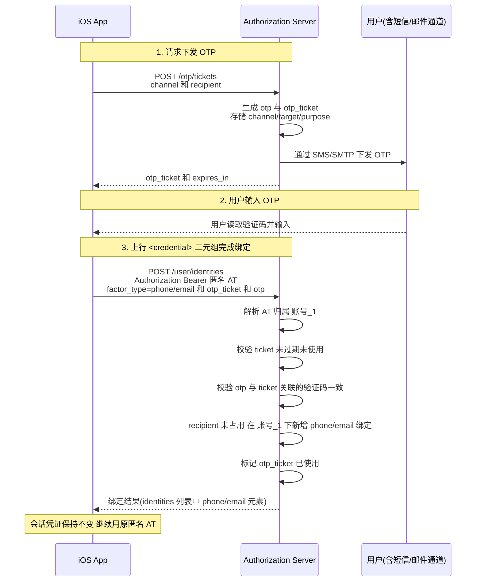
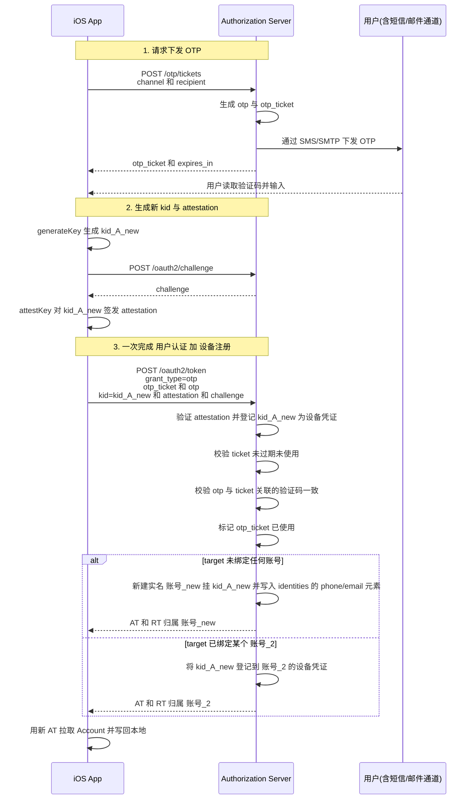

# App Attest 登录 - 短信 / 邮箱 OTP 接入细节

本文档是 [Apple App Attest 登录完整流程文档](App-Attest-Login.md) 的配套附录, 专门描述**短信 / 邮箱 OTP**(One-Time Password, 一次性验证码)作为 `<user_grant>` 接入时的具体细节. 总流程、抽象概念、客户端持久化数据、异常处置、退出登录、常见坑位等均请参考上位文档, 本文只补充 OTP 侧的实例化内容.

---

## 一. 抽象概念在 OTP 侧的映射

| 总文档抽象 | OTP 落地 |
|---|---|
| `<user_grant>` | `otp`(自定义 grant type, 统一承载所有 OTP 通道) |
| `<credential>` | `otp_ticket` + `otp` 二元组 |
| `factor_type` | `phone`(短信通道绑定结果) / `email`(邮箱通道绑定结果) |
| 唯一标识 | E.164 手机号 / 邮箱地址 |
| CP(Credential Provider) | 用户本人(在设备上输入 OTP) + 平台下发通道(SMS / SMTP) |

落到 `/oauth2/token` 请求矩阵:

| `grant_type` | 关键参数 | 用途 |
|---|---|---|
| `otp` | `otp_ticket` + `otp` + `attestation` | 标准 OTP 登录(含设备注册)— App Attestation 用法二 |

> 注: 本平台自定义的 `grant_type=otp` 只负责"以 OTP 作为用户证明"这件事, 具体的通道类型(`sms` / `email` / 未来扩展)、下发目标(`target`)、业务用途(`purpose`)均在 `otp_ticket` 签发时记录于服务端, 客户端在 `/oauth2/token` 时无需重复提交.

### OTP 侧关键角色

| 角色 | 含义 |
|---|---|
| **用户** | 在设备上读取短信 / 邮件中的 OTP 并输入到 App |
| **下发通道** | 服务端将 OTP 下行到 `recipient` 的能力提供方(运营商短信网关 / SMTP 邮件服务), 属于服务端内部依赖, 对客户端不可见 |

---

## 二. 发送 OTP: `POST /otp/tickets`

**此接口为平台通用接口, 不专属 OAuth.** 调用方通过 `channel` 指定下发途径, 通过 `purpose` 声明业务用途, 服务端按 `purpose` 选择对应的文案模板 / 频率策略 / 有效期 / 后续允许的调用接口.

### 2.1 请求

```http
POST /otp/tickets
Content-Type: application/x-www-form-urlencoded

channel=sms
&recipient=%2B8613900000000
&purpose=sign_in
```


| 参数 | 必选 | 说明 |
|---|---|---|
| `channel` | 是 | **下发通道**<br>`sms` / `email` / 未来扩展(如 `voice`) |
| `recipient` | 是 | **下发目标**<br>手机号需符合 E.164 格式, 邮箱需为合法邮箱地址. |
| `purpose` | 否 | **业务用途**<br>可选参数, 可以在后续的验证流程中验证是否是期望的用途, 若不指定表示可以用于任何用途.|

### 2.2 响应

```json
{
  "otp_ticket": "ot_2b8f4e...",
  "expires_in": 300,
  "retry_after": 60
}
```

| 字段 | 说明 |
|---|---|
| `otp_ticket` | **本次 OTP 会话句柄**, 服务端签发的不可预测短随机串, 单次使用 |
| `expires_in` | OTP 有效期(秒), 过期后 `otp_ticket` 连同 OTP 一起失效 |
| `retry_after` | 调用方再次发起 `POST /otp/tickets` 的最短间隔(秒). 限流维度针对调用方, 即使更换 `target` / `purpose` 在该间隔内仍不会下发 |

> `otp_ticket` 与 OTP 一一强绑定, 同时记录 `channel`、`target`、`purpose`、下发时间、已校验失败次数等. 客户端仅需持有 `otp_ticket`, 无需理解其内部结构.

---

## 三. 绑定场景: 匿名账号追加手机 / 邮箱绑定

本场景对应[总文档场景一步骤 3](App-Attest-Login.md#场景一-首次使用--匿名登录--绑定登录因素--日常使用)(匿名账号追加手机 / 邮箱绑定). 客户端先调 `POST /otp/tickets`触发下发, 用户输入 OTP 后, 凭匿名 AT 调 `POST /user/identities` 上行 `otp_ticket` + `otp` 二元组, 服务端校验通过后在当前账号下新增 `phone` / `email` 元素.



> 若目标手机号 / 邮箱已被其他账号占用, 服务端返回 `409 factor_occupied` 附带 `conflict_token`, 处置方式参见[总文档步骤 3 异常](App-Attest-Login.md#步骤-3-异常-登录因素已被其他账号占用).

---

## 四. 标准 OTP 登录完整流程

本场景对应[总文档场景二](App-Attest-Login.md#场景二-标准登录). 客户端先走 `POST /otp/tickets`(无 `purpose`)拿到 `otp_ticket` 并等待用户输入 OTP, 再生成新 `kid` 与 `attestation`, 一并上行 `/oauth2/token`(`grant_type=otp`), 服务端一次性完成"OTP 验证 + 设备注册". 对于新注册(`recipient` 尚未绑定任何账号)的分支, 服务端将 `target` 写入新账号的 `identities`; 已绑定账号的分支直接复用原有 `identities`.



---

## 五. 请求示例

### 5.1 发送 OTP(通用接口, 示例为登录场景)

```http
POST /otp/tickets
Content-Type: application/x-www-form-urlencoded

channel=sms
&recipient=%2B8613900000000
```

### 5.2 标准 OTP 登录(含设备注册)— App Attestation 用法二

```http
POST /oauth2/token
OAuth-Client-Attestation-Type: apple_app_attest
Content-Type: application/x-www-form-urlencoded

grant_type=otp
&otp_ticket={otp_ticket}
&otp={用户输入的验证码}
&kid={new_kid}
&attestation={Base64(Attestation Object)}
&challenge={challenge}
&scope=openid
```

### 5.3 绑定手机 / 邮箱(使用匿名 AT)

```http
POST /user/identities
Authorization: Bearer {匿名 AT}
Content-Type: application/x-www-form-urlencoded

factor_type=phone
&otp_ticket={otp_ticket}
&otp={用户输入的验证码}
```

---

## 六. `Account.identities` 中 phone / email 元素结构

作为 `identities` 列表中 `factor_type=phone` / `factor_type=email` 的元素, 由公共字段(`identity_id` / `factor_type` / `bound_at`, 详见[总文档 2.2 用户账号数据](App-Attest-Login.md#22-用户账号数据-account))与 OTP 原生字段两部分组成:

```json
{
  "identity_id": "idp_7h8j9k0l...",
  "factor_type": "phone",
  "bound_at": "2026-05-10T09:00:00Z",
  "recipient": "+8613*******00",
  "last_verified_at": "2026-05-10T09:00:00Z"
}
```

```json
{
  "identity_id": "idp_7kbp651...",
  "factor_type": "email",
  "bound_at": "2026-05-10T09:00:00Z",
  "recipient": "u**r@e*****e.com",
  "last_verified_at": "2026-05-10T09:00:00Z"
}
```

| 字段 | 类型 | 含义 |
|---|---|---|
| `identity_id` | string | **公共字段** — 登录因素 ID <br> 在 OTP 这一细分场景下可以替代原始手机号或邮箱调用 `POST /otp/tickets` 做 OTP 二次下发, 避免用户隐私信息频繁暴露于网络链路. |
| `factor_type` | string | **公共字段** — 固定为 `phone` / `email`, 用于在 `identities` 列表中识别该元素的类型 |
| `bound_at` | string (ISO8601) | **公共字段** — 首次绑定时间 |
| `recipient` | string | **已验证且脱敏的手机号 / 邮箱地址** |
| `last_verified_at` | string (ISO8601) | 最近一次通过 OTP 验证该因素的时间 |

> 与微信 IdP 不同, `phone` / `email` 元素无需额外的原生用户资料字段(昵称、头像等), 故无 "/userinfo" 类二次拉取.

---

## 七. 相关文档

- [Apple App Attest 登录完整流程文档](App-Attest-Login.md) — 本文档的上位文档, 描述抽象的完整流程
- [微信 IdP 接入细节](App-Attest-Login-%23-WeChat.md) — 另一种 `<user_grant>` 的接入示例
- [RFC 4226: HOTP](https://datatracker.ietf.org/doc/html/rfc4226) / [RFC 6238: TOTP](https://datatracker.ietf.org/doc/html/rfc6238) — 一次性验证码算法规范(本平台 OTP 非 TOTP, 仅列为参考)
- [APIs # Apple App Attest](APIs-%23-Apple-App-Attest.md)
- [APIs # OAuth2 Grant](APIs-%23-OAuth2-Grant.md)
- [APIs # OAuth2 Challenge](APIs-%23-OAuth2-Challenge.md)
- [APIs # IdentityProvider Bind](APIs-%23-IdentityProvider-Bind.md)
