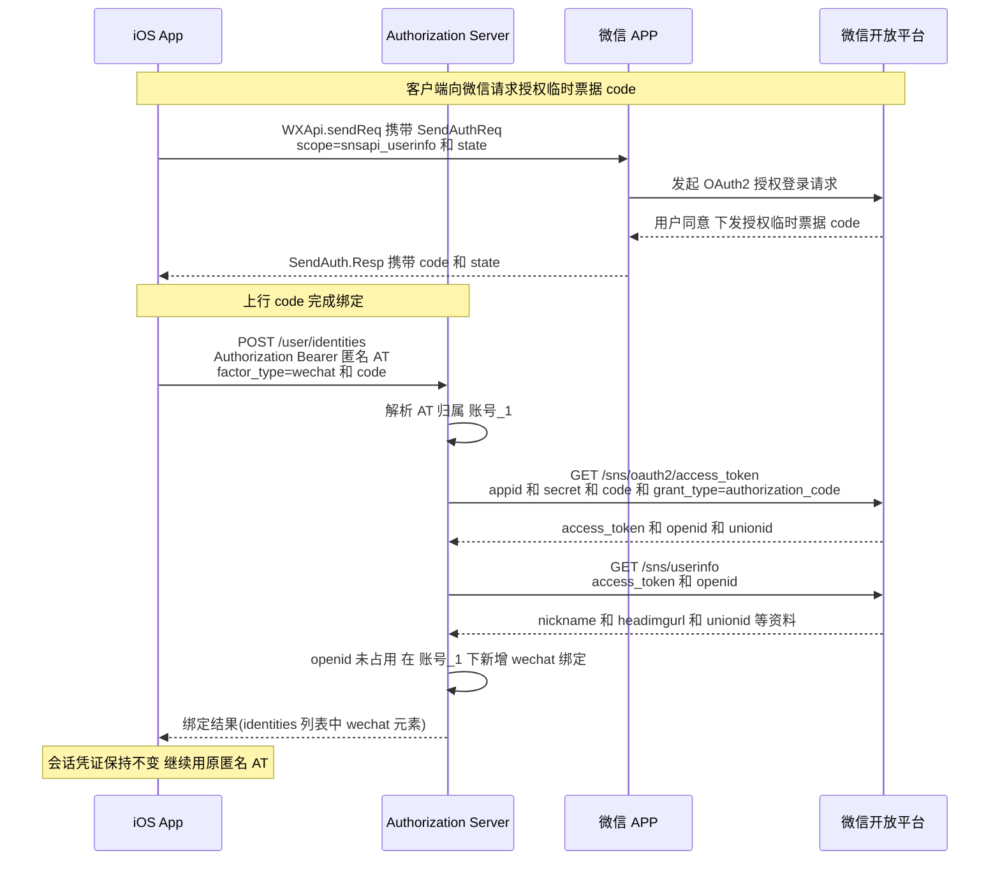
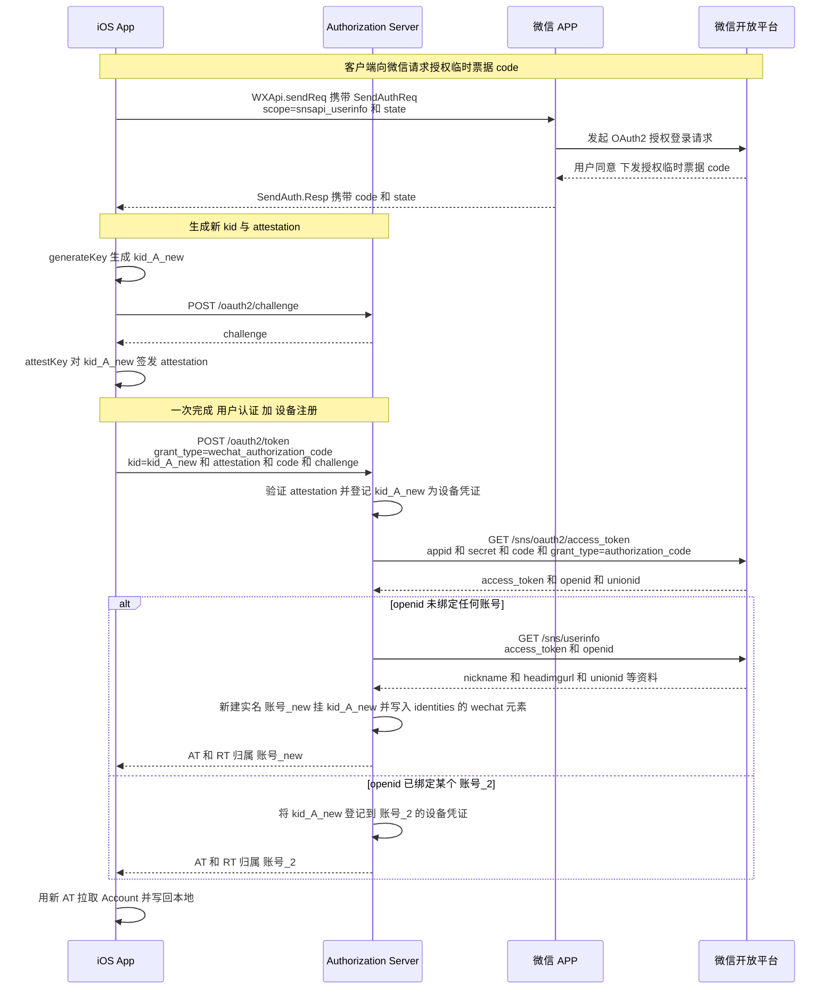

# App Attest 登录 # 微信 IdP 接入细节

本文档是 [Apple App Attest 登录完整流程文档](App-Attest-Login.md) 的配套附录, 专门描述**微信**作为 `<user_grant>` 接入时的具体细节. 总流程、抽象概念、客户端持久化数据、异常处置、退出登录、常见坑位等均请参考上位文档, 本文只补充微信侧的实例化内容.

---

## 一. 抽象概念在微信侧的映射

| 总文档抽象 | 微信落地 |
|---|---|
| `<user_grant>` | `wechat_authorization_code` |
| `<credential>` | 微信授权登录后回传的**授权临时票据** `code` |
| `factor_type` | `wechat` |

落到 `/oauth2/token` 请求矩阵:

| `grant_type` | 关键参数 | 用途 |
|---|---|---|
| `wechat_authorization_code` | `code` + `attestation` | 标准微信登录(含设备注册) — App Attestation 用法二 |

> 注: 本平台自定义的 `grant_type=wechat_authorization_code` 代表"以微信授权码作为用户证明"的 grant type, 与微信开放平台 `/sns/oauth2/access_token` 接口自身的 `grant_type=authorization_code` 参数分属两个体系, 切勿混淆.

### 微信侧关键角色

| 角色 | 含义 |
|---|---|
| **微信 APP** | 用户手机上安装的微信 App, 通过微信 Open SDK(`WXApi.sendReq`) 被第三方 App 拉起, 负责用户本地同意 / 拒绝授权 |
| **微信开放平台** | 微信的 OAuth2.0 授权服务器, 下发授权临时票据 `code`, 并提供 `/sns/oauth2/access_token` 等后端接口 |

---

## 二. 绑定微信完整流程

本场景对应[总文档场景一步骤 3](App-Attest-Login.md#场景一-首次使用--匿名登录--绑定登录因素--日常使用)(匿名账号追加微信绑定). 客户端通过微信 Open SDK 发起 OAuth2.0 授权登录请求, 拿到授权临时票据 `code` 后, 凭匿名 AT 调用 `POST /user/identities` 上行 `code`; 本平台服务端再用 `code` + `AppSecret` 向微信开放平台换 `access_token` 与 `openid`, 再用 `access_token` + `openid` 去 [`/sns/userinfo`](https://developers.weixin.qq.com/doc/oplatform/Mobile_App/WeChat_Login/Authorized_API_call_UnionID.html) 读取昵称 / 头像 / `unionid` 等用户资料, 写入 `identities` 列表完成绑定.



> 若 `openid` 已被其他账号占用, 服务端返回 `409 factor_occupied` 附带 `conflict_token`, 处置方式参见[总文档步骤 3 异常](App-Attest-Login.md#步骤-3-异常-登录因素已被其他账号占用).

---

## 三. 标准微信登录完整流程

本场景对应[总文档场景二](App-Attest-Login.md#场景二-标准登录). 客户端先通过微信 Open SDK 拿到授权临时票据 `code`, 再生成新 `kid` 与 `attestation`, 一并上行 `/oauth2/token`(`grant_type=wechat_authorization_code`), 服务端一次性完成"微信登录 + 设备注册". **仅当 `openid` 尚未绑定任何账号时**, 服务端才调用 [`/sns/userinfo`](https://developers.weixin.qq.com/doc/oplatform/Mobile_App/WeChat_Login/Authorized_API_call_UnionID.html) 读取昵称 / 头像 / `unionid` 等资料写入新账号的 `identities`; 若已绑定账号, 直接复用绑定时写入的历史 `identities` 数据, 不重拉.



---

## 四. 请求示例

### 4.1 标准微信登录(含设备注册)— App Attestation 用法二

```http
POST /oauth2/token
OAuth-Client-Attestation-Type: apple_app_attest
Content-Type: application/x-www-form-urlencoded

grant_type=wechat_authorization_code
&code={wxCode}
&kid={new_kid}
&attestation={Base64(Attestation Object)}
&challenge={challenge}
&scope=openid
```

### 4.2 绑定微信(使用匿名 AT)

```http
POST /user/identities
Authorization: Bearer {匿名 AT}
Content-Type: application/x-www-form-urlencoded

factor_type=wechat
&code={wxCode}
```

---

## 五. `Account.identities` 中 wechat 元素结构

作为 `identities` 列表中 `factor_type=wechat` 的元素, 由公共字段(`identity_id` / `factor_type` / `bound_at`, 详见[总文档 2.2 用户账号数据](App-Attest-Login.md#22-用户账号数据-account))与 IdP 原生字段两部分组成; 其中 IdP 原生字段与 `GET https://api.weixin.qq.com/sns/userinfo?access_token=ACCESS_TOKEN&openid=OPENID` 接口返回值保持一致:

```json
{
  "identity_id": "idp_7h8j9k0l...",
  "factor_type": "wechat",
  "bound_at": "2026-05-10T09:00:00Z",
  "openid": "oX1a2b3c4d5e6f",
  "nickname": "微信原始昵称",
  "headimgurl": "https://wx.qlogo.cn/mmopen/xxx/132",
  "unionid": " o6_bmasdasdsad6_2sgVt7hMZOPfL"
}
```

| 字段 | 类型 | 含义 |
|---|---|---|
| `identity_id` | string | **公共字段** — 登录因素 ID, 服务端为该绑定记录签发的稳定标识 |
| `factor_type` | string | **公共字段** — 固定为 `wechat`, 用于在 `identities` 列表中识别该元素的类型 |
| `bound_at` | string (ISO8601) | **公共字段** — 首次绑定时间 |
| `openid` | string | **授权用户唯一标识** <br> 客户端一般不直接使用, 仅作"已绑定微信"的证据 |
| `nickname` | string | **微信原始昵称** <br> 用于"社交账号绑定"管理页展示, 与 `profile.nickname` 独立 |
| `headimgurl` | string | **微信原始头像** <br> 用于"社交账号绑定"管理页展示, 与 `profile.avatar_url` 独立 |
| `unionid` | string | **用户统一标识** <br> 针对一个微信开放平台账号下的应用, 同一用户的 unionid 是唯一的. |

> 关于 `profile.nickname / avatar_url` 与 `identities` 列表中 wechat 元素 `nickname / headimgurl` 的"两层存储"分工, 详见总文档 [2.2 用户账号数据](App-Attest-Login.md#22-用户账号数据-account).

---

## 六. 相关文档

- [Apple App Attest 登录完整流程文档](App-Attest-Login.md) — 本文档的上位文档, 描述抽象的完整流程
- [微信开放平台 · 移动应用微信登录开发指南](https://developers.weixin.qq.com/doc/oplatform/Mobile_App/WeChat_Login/Development_Guide.html) — 微信官方接入规范
- [微信开放平台 · 授权后接口调用 UnionID](https://developers.weixin.qq.com/doc/oplatform/Mobile_App/WeChat_Login/Authorized_API_call_UnionID.html) — `/sns/oauth2/access_token`、`/sns/userinfo` 等接口定义
- [微信登录结合 AppleAppAttest 设计文档](微信登录结合AppleAppAttest设计文档.md)
- [APIs # Apple App Attest](APIs-%23-Apple-App-Attest.md)
- [APIs # OAuth2 Grant](APIs-%23-OAuth2-Grant.md)
- [APIs # OAuth2 Challenge](APIs-%23-OAuth2-Challenge.md)
- [APIs # IdentityProvider Bind](APIs-%23-IdentityProvider-Bind.md)
