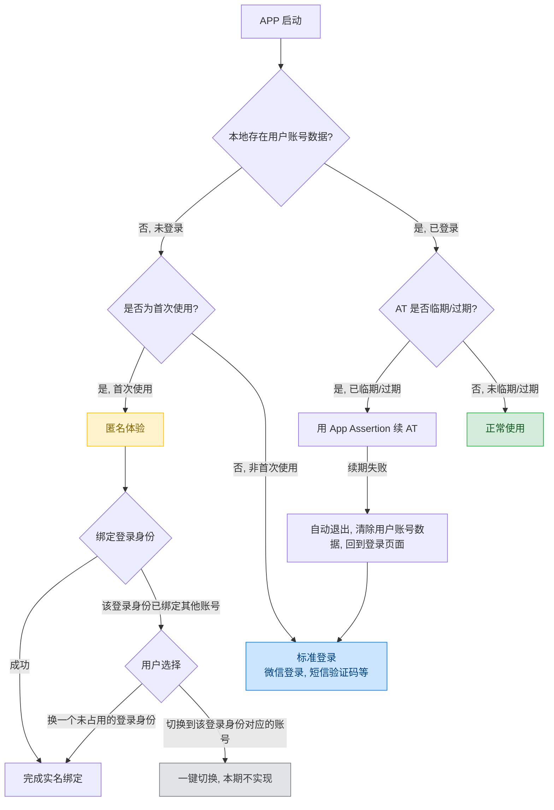
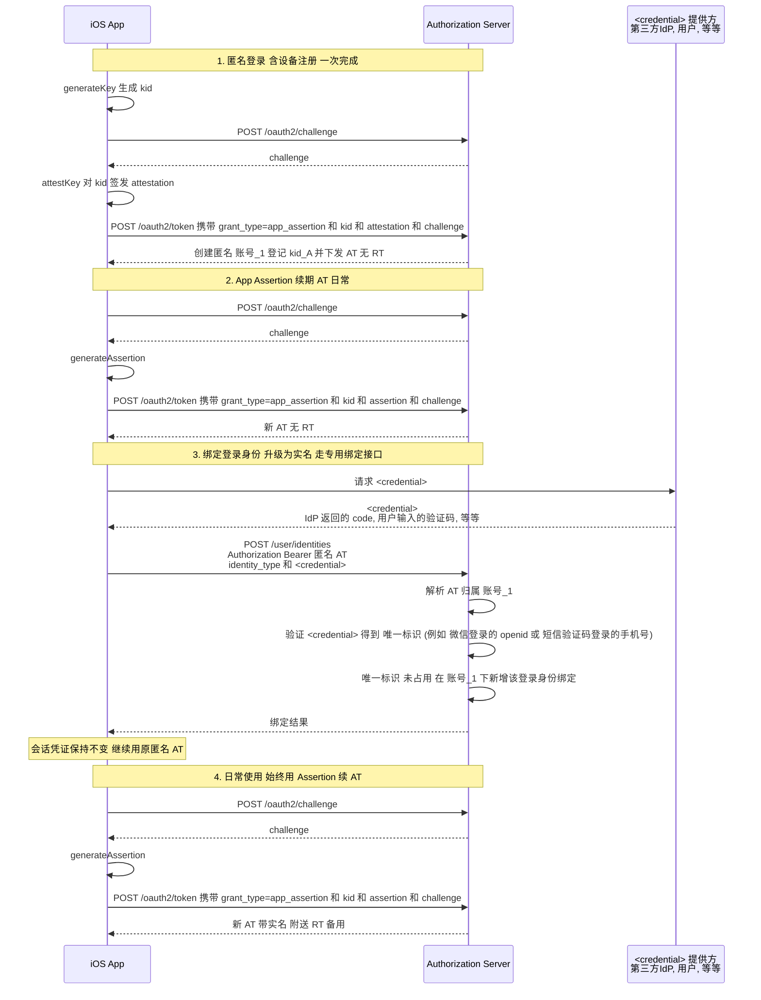
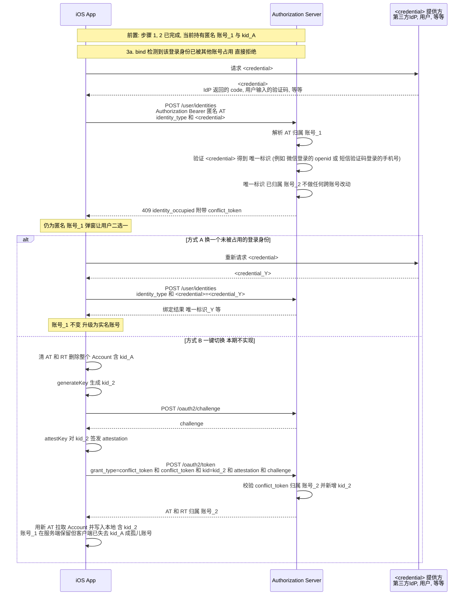
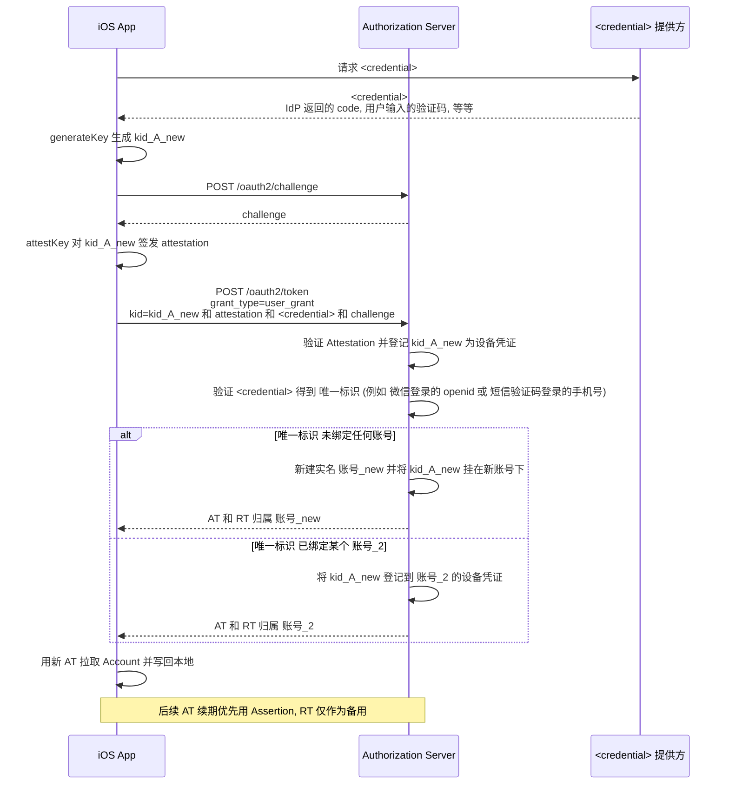

# Apple App Attest 登录完整流程文档

本文档从客户端开发者视角, 系统性地梳理 iOS App 使用身份认证服务基于 Apple App Attest 一次性完成"设备证明 + 用户证明", 由服务端完成设备注册并签发 Token 的完整流程, 并列出两种典型场景及其调用顺序、关键参数与数据结构演变.

本文档采用抽象描述, **用户认证方式统一以 `<user_grant>` 代指**. 它可以是任意一种 OAuth 2.1 Grant Type, 例如:

- **IdP 授权码**: 微信 / Apple / Google / GitHub 等
- **手机/邮箱 OTP**
- **`authorization_code`** 等标准内置 grant type

具体 `<user_grant>` 的接入细节由各自专项文档描述(例如[微信登录 IdP 接入细节](App-Attest-Login-%23-WeChat.md)、[短信 / 邮箱 OTP 接入细节](App-Attest-Login-%23-OTP.md)), 本文聚焦在**设备证明 + 用户证明**的组合机制本身.

---

## 零. 流程预览

客户端在每次启动 APP 时, 应按以下决策树判断走哪条路径:



---

## 一. 核心概念

在动手对接之前, 先统一几个关键概念, 否则后续流程会难以理解:

| 概念 | 说明 |
|---|---|
| App Attestation | **本质上是用户在一台新设备登录, 登录成功的同时信任该设备.**<br>APP `generateKey()` + `attestKey()` 生成新的 Apple App Attest Key 与 `Attestation` 对象, 上行服务端完成设备注册与首轮 AT 获取. 包含多种用法, 详见下文 [App Attestation 使用场景] |
| App Assertion | **本质上是用户在一台已信任的设备上继续登录使用.**<br>APP `generateAssertion()` 基于本地已有的 Apple App Attest Key 生成 `Assertion` 对象, 上行服务端完成 AT 获取 / 续期. 包含多种用法, 详见下文 [App Assertion 使用场景]. |
| kid | **Apple App Attest Key Identifier**<br>APP 调用 `generateKey()` 生成, APP 应将其存储于 `Account.appAttestKey.kid`. 其对应的私钥实体存放于设备的 Secure Enclave 中, 外界无法读取. |
| `<user_grant>` | **用户证明方式**<br>对应的 OAuth 2.1 `grant_type`, 例如 IdP 授权码(微信/Apple/Google 等)、手机验证码、邮箱验证码、`authorization_code`等. |
| `<credential>` | **`<user_grant>` 所需的用户凭据参数(泛指)**<br>例如 IdP 的 `code`、短信 OTP 的 `phone + code`、邮箱 OTP 的 `email + code`、`authorization_code`等. 具体参数由对应 grant type 的接入文档定义. |
| `<credential>` 提供方 | **Credential Provider, CP**<br>代指为当前 `<user_grant>` 提供 `<credential>` 的实体, 既可能是外部 IdP 的授权服务器(授权码场景), 也可能就是用户本人(验证码场景). |
| AT | Access Token. |
| RT | Refresh Token. |
| 匿名账号 | 除系统分配的用户名外, 未绑定任何其他登录身份的账号. |
| 实名账号 | 除系统分配的用户名外, 至少绑定一个其他登录身份的账号. |

### App Attestation 使用场景

> App Attestation 本质上是用户在一台新设备登录, 登录成功的同时信任该设备.

#### 用法一: 匿名体验

通过 `/oauth2/token`(`grant_type=app_assertion`) + `attestation` 参数一次性完成设备注册、创建匿名账号并下发 AT, 让用户先体验起来.

#### 用法二: 标准登录

通过 `/oauth2/token`(`grant_type=<user_grant>`) + `attestation` + `<credential>` 参数一次性完成用户认证与设备注册, 为标准模式.

#### 用法三: 绑定登录身份发生冲突时直接用 Conflict Token 一键切换至已绑定的账号(本期不实现)

绑定登录身份时, 如果服务端检测到该登录身份已绑定至其他账号, 会通过 `409` 响应返回 `conflict_token`, APP 可以通过 `/oauth2/token`(`grant_type=conflict_token`) + `attestation` + `conflict_token` 参数一键切换至该登录身份已绑定的账号.

### App Assertion 使用场景

> App Assertion 本质上是用户在一台已信任的设备上继续登录使用.

#### 用法一: 日常 AT 获取 / 续期

支持静默获取 / 续期 AT, 用户无感, 速度快, 体验好, 匿名/实名账号均适用, 为获取 / 续期 AT 的标准模式.

#### 用法二: 快速登录(本期不实现)

通过 `/oauth2/token`(`grant_type=<user_grant>`) + `assertion` + `<credential>` 参数完成用户认证(没有设备注册). 这种方式适合多账号切换.

### `/oauth2/token` 请求矩阵

所有注册 / 登录 / 续期请求收敛到 `/oauth2/token`, 通过 `grant_type` 与附加参数区分:

| `grant_type` | 关键参数 | 用途 |
|---|---|---|
| `app_assertion` | `attestation` | 首次匿名登录(含设备注册) — App Attestation 用法一 |
| `app_assertion` | `assertion` | AT 获取 / 续期(匿名/实名通用) — App Assertion 用法一 |
| `<user_grant>` | `<credential>` + `attestation` | 标准登录(含设备注册) — App Attestation 用法二 |
| `<user_grant>` | `<credential>` + `assertion` | 快速登录(本期不实现) — App Assertion 用法二 |
| `conflict_token` | `conflict_token` + `attestation` | 切换至已绑定的账号(本期不实现) — App Attestation 用法三 |

> `grant_type=app_assertion` 的完整 URI 为 `urn:ietf:params:oauth:grant-type:app_assertion`, 表格中用简写.

### 服务端点发现 (OIDC Discovery)

本文涉及的端点分为两类, 客户端寻址方式不同:

1. **授权服务端点**(随授权服务一起部署): 包括 `/oauth2/token`、`/userinfo`、JWKS 等 OIDC/OAuth2 标准端点, 以及 `/oauth2/challenge` 这类**非标准但仍归属于授权服务**的扩展端点.
2. **用户账号服务端点** (Account Service, 可能部署在独立域名): 例如 `/user/identities` 等账号身份管理接口, 与授权服务的 `issuer` 无直接关系.

#### 授权服务端点: 通过 OIDC Discovery 发现

本平台授权服务遵循 [OpenID Connect Discovery 1.0](https://openid.net/specs/openid-connect-discovery-1_0.html) 规范, 客户端**不要硬编码或单独配置** `/oauth2/token`、`/userinfo`、JWKS 等标准端点路径, 应在启动后从 Discovery 拉取并缓存.

- **唯一需要配置的是授权服务的 `issuer`**(例: `https://auth.example.com`).
- 客户端从 `https://{issuer}/.well-known/openid-configuration` 拉取 `OpenID Provider Metadata`, 从中读取实际端点, 例如:
  - `token_endpoint` —— 本文 `POST /oauth2/token` 的实际地址
  - `userinfo_endpoint` —— 本文 `GET /userinfo` 的实际地址
  - `jwks_uri` —— 拉取 JWKS, 用于验签 `id_token`
  - 其他端点(如 `end_session_endpoint`)按需使用
- `/oauth2/challenge` 虽非 OIDC/OAuth2 标准端点, 但与授权服务一起部署, 与 `token_endpoint` 同源(同 `issuer`), 客户端可基于已发现的授权服务基地址按 `/oauth2/challenge` 路径拼接.
- 本文为简洁起见沿用 `/oauth2/token`、`/userinfo`、`/oauth2/challenge` 等简写, 客户端实际请求请以 Discovery 返回值(及与之同源的扩展路径)为准.

OIDC 为成熟标准协议, 客户端按规范实现即可, 本文不再展开.

#### 用户账号服务端点: 独立配置

`/user/identities` 等账号身份管理接口由**用户账号服务 (Account Service)** 提供, **不属于授权服务**, 也不会出现在 OIDC Discovery 元数据中, 其基地址可能与授权服务的 `issuer` 不同.

- 客户端应**独立配置用户账号服务基地址**(例: `https://account.example.com`), 与 `issuer` 解耦.
- 本文中形如 `POST /user/identities`、`GET /user/identities` 的写法均为相对路径简写, 实际请求时拼接到用户账号服务基地址即可.
- 调用账号服务接口时统一使用 `Authorization: Bearer <access_token>`, 由账号服务作为资源服务校验 AT.

> **demo 环境说明**: 本 demo 中用户账号服务与授权服务合部署, 共享同一个端点 `https://auth.example.com`. 但客户端实现时仍应**将二者作为独立配置项分别维护**, 以免将来账号服务拆分、端点变更时需要发版修复.

---

## 二. 客户端需要持久化的数据

客户端持久化的数据分为**会话凭证**和**用户账号数据**两类, **全部必须存入 Keychain**, 禁止 `UserDefaults`/`plist`(越狱设备可明文读取).

**用户退出登录时这两个数据必须全部删除.**

### 2.1 会话凭证 (Session Credentials)

| 字段 | 类型 | 含义 |
|---|---|---|
| `accessToken` | string | 业务接口凭证, 约 1 小时 |
| `accessTokenExpiresAt` | date | AT 绝对过期时间, 用于临期判断 |
| `refreshToken` | string | 续期凭证, 约 30 天, **仅实名账号下发** |
| `refreshTokenExpiresAt` | date | RT 绝对过期时间 |

### 2.2 用户账号数据 (Account)

> 这里的示例为了跟接口返回格式一致, 采用下划线风格, APP 实现时可自行映射为驼峰风格.

```json
{
  "profile": {
    "username": "apple_app_f3a2",
    "nickname": "小龙包",
    "avatar_url": "https://cdn.example.com/avatar/u_7b2e9c31.png"
  },
  "app_attest_key": {
    "kid": "<base64-url-encoded-kid>",
    "iat": "2026-05-10T12:34:56Z"
  },
  "identities": [
    {
      "identity_id": "550e8400-e29b-41d4-a716-446655440000",
      "identity_type": "wechat",
      "identifier": "oX1a2b3c4d5e6f",
      "bound_at": 1778899139687,
      "openid": "oX1a2b3c4d5e6f",
      "nickname": "微信原始昵称",
      "headimgurl": "https://wx.qlogo.cn/mmopen/xxx/132",
      "unionid": "o6_bmasdasdsad6_2sgVt7hMZOPfL"
    }
  ]
}
```

字段说明:

| 字段 | 类型 | 含义 |
|---|---|---|
| `profile` | dict | **用户档案**<br>`POST /oauth2/token` 时 `scope` 务必包含 `openid` 和 `profile`, 可从返回的 `id_token` 解析, 或使用 AT 调用 `GET /userinfo` 获取 |
| `profile.username` | string | **用户登录名** |
| `profile.nickname` | string | **用户昵称** |
| `profile.avatar_url` | string | **用户头像 URL** |
| `app_attest_key` | dict | **Apple App Attest Key 摘要数据**<br>APP `generateKey()` 后一次写入, 之后只读, 服务端不下发; 删除 `Account` 即丢失 `kid`, Secure Enclave 中对应的私钥随即不可寻址 |
| `app_attest_key.kid` | string | **Apple App Attest Key Identifier** |
| `app_attest_key.iat` | date |  **Apple App Attest Key 的生成时间 (Issued At)** |
| `identities` | list | **账号绑定的登录身份(微信 / 手机 / 邮箱 等)列表**<br>使用 AT 调用 `GET /user/identities` 获取, 列表中每个元素都包含下述公共字段; 各登录身份在公共字段之外可追加自身原生字段; 下文以 `wechat` 为例 |
| `identities[].identity_id` | string | **公共字段 — 登录身份 ID**<br>服务端为该登录身份生成的 UUID. |
| `identities[].identity_type` | string | **公共字段 — 登录身份类型标识**<br>例如 `wechat` / `apple` / `google` / `phone` / `email` 等 |
| `identities[].identifier` | string | **公共字段 — 登录身份的唯一标识**<br>不同 `identity_type` 各自定义其含义(如 `wechat` 取值为 `openid` 原值、`phone` / `email` 取值为原始手机号 / 邮箱的哈希值) |
| `identities[].bound_at` | timestamp(3) | **公共字段 — 首次绑定时间**<br>毫秒级 Unix 时间戳 |

#### IdP 示例: wechat

> 本节以微信作为 `identities` 列表中某个元素(`identity_type=wechat`)的示例; 其他登录身份(Apple / Google / GitHub / 手机 / 邮箱 等)的元素结构类似, 由各自接入文档定义.

`wechat` 元素由公共字段(`identity_id` / `identity_type` / `identifier` / `bound_at`)与 IdP 原生字段两部分组成; 其中 IdP 原生字段与 `GET https://api.weixin.qq.com/sns/userinfo?access_token=ACCESS_TOKEN&openid=OPENID` 接口返回值保持一致

```json
{
  "identity_id": "550e8400-e29b-41d4-a716-446655440000",
  "identity_type": "wechat",
  "identifier": "oX1a2b3c4d5e6f",
  "bound_at": 1778899139687,
  "openid": "oX1a2b3c4d5e6f",
  "nickname": "微信原始昵称",
  "headimgurl": "https://wx.qlogo.cn/mmopen/xxx/132",
  "unionid": "o6_bmasdasdsad6_2sgVt7hMZOPfL"
}
```

| 字段 | 类型 | 含义 |
|---|---|---|
| `openid` | string | **微信 openid**<br>客户端一般不直接使用, 仅作"已绑定微信"的证据 |
| `nickname` | string | **微信原始昵称**<br>用于"社交账号绑定"管理页展示, 与 `profile.nickname` 独立 |
| `headimgurl` | string | **微信原始头像**<br>用于"社交账号绑定"管理页展示, 与 `profile.avatar_url` 独立 |
| `unionid` | string | **用户统一标识**<br>针对一个微信开放平台账号下的应用, 同一用户的 unionid 是唯一的. |

> **`nickname / avatar_url` 分两层存储的作用**:
> - `profile.nickname / avatar_url` 是**用户的最终展示值**, 用于 APP 主页、评论、排行榜; 用户可在设置中自定义, 自定义后不再随 IdP 资料变化.
> - `identities` 列表中对应登录身份元素的 nickname / 头像等字段是**对应登录身份的原始资料**, 用于"账号与安全 - 已绑定账号"管理页, 供用户辨识所绑账号; 重新绑定或主动拉取时刷新, 不影响外层展示值.

### 2.3 判断"是否在线"

> 在线的定义是: 客户端有从 `POST /oauth2/token` 静默获取 AT 的能力. 

**只要本地有可用的 `kid`, 就视为在线.** 因为:
- AT 未过期 且 `kid` 有效, 可直接调用业务接口.
- AT 已过期 但 `kid` 有效, 可通过 App Assertion 静默续期 AT.

其他情况视为离线, APP 应跳转登录页引导用户重新完成一次[标准登录](#场景二-标准登录).


### 2.4 判断 APP 是否有匿名试用机会

APP 应自行设计适当机制标记是否为首次使用. 若非首次使用, 必须要求用户走标准登录流程, 不提供匿名试用机会.

推荐方案: 通过 `Account` 之外且不随退出清除的本地数据(例如设备端 UUID、本地业务数据索引)间接判断.

---

## 三. 典型场景

下文将分别介绍**首次使用 → 匿名登录 → 绑定登录身份 → 日常使用**(场景一)和**标准登录**(场景二)两种典型场景的完整流程.

### 场景一: 首次使用 → 匿名登录 → 绑定登录身份 → 日常使用

最常见的主流程: 当前设备从未使用过本 APP, 且用于绑定的登录身份从未在本 APP 登录过.

#### 步骤

1. **匿名登录(含设备注册, 一次完成)**
   - 本地 `DCAppAttestService.generateKey()` 生成 `kid`
   - 调 `POST /oauth2/challenge` 拿 `challenge`
   - 本地 `DCAppAttestService.attestKey()` 生成 `attestation`
   - 调 `POST /oauth2/token`:
     - Header: `OAuth-Client-Attestation-Type: apple_app_attest`
     - Body: `grant_type=urn:ietf:params:oauth:grant-type:app_assertion&kid=...&attestation=...&challenge=...`
   - 服务端验证 `attestation` 后**创建匿名账号并登记 `kid`**, 返回 AT + `sub`(匿名 username). 匿名账号**只有 AT, 没有 RT**.
   - 此时数据结构: `kid_A -> 账号_1 (匿名)`

2. **App Assertion 续期 AT(日常使用)**
   - 调 `POST /oauth2/challenge` 拿 `challenge`
   - 本地 `DCAppAttestService.generateAssertion()` 生成 `assertion`
   - 调 `POST /oauth2/token`:
     - Header: `OAuth-Client-Attestation-Type: apple_app_attest`
     - Body: `grant_type=urn:ietf:params:oauth:grant-type:app_assertion&kid=...&assertion=...&challenge=...`
   - 响应**只有 AT, 没有 RT**. AT 过期后重复本步骤即可.

3. **绑定登录身份(升级为实名账号)**
   - 客户端按所选登录身份的流程拿到 `<credential>`(例如 IdP 的 `code`、手机/邮箱 OTP 等)
   - 客户端**使用步骤 2 获得的匿名 AT** 调用专用绑定接口 `POST /user/identities`:
     - Header: `Authorization: Bearer {匿名 AT}`
     - Body: `identity_type=<identity_type>&<credential>`
   - 服务端:
     - 解析 AT 归属 `账号_1`
     - 验证 `<credential>`, 得到该登录身份对外的 `唯一标识` (例如 微信登录的 openid 或 短信验证码登录的手机号)
     - 确认 `唯一标识` 未被任何账号占用
     - 在 `账号_1` 下追加一条该登录身份的绑定记录, 该账号从此具备登录身份.
   - 响应包含该登录身份的绑定结果(格式与 `Account.identities` 列表中对应登录身份元素一致, 客户端追加到本地数组中)
   - **异常: `唯一标识` 已被其他账号占用**— `POST /user/identities` 返回错误, 当前仍为匿名 `账号_1`. 应引导用户二选一, 详见下文[步骤 3 异常: 登录身份已被其他账号占用](#步骤-3-异常-登录身份已被其他账号占用).

4. **日常使用 (始终用 App Assertion 续 AT)**
   - 当 AT 临期/过期后, 客户端 **重新跑一次 App Assertion** (步骤 2 的流程) 即可续期 AT:
     - Header: `OAuth-Client-Attestation-Type: apple_app_attest`
     - Body: `grant_type=urn:ietf:params:oauth:grant-type:app_assertion&kid=...&assertion=...&challenge=...`

#### 正常流程时序图



#### 步骤 3 异常: 登录身份已被其他账号占用

本次使用的登录身份对应 `唯一标识` 在服务端已属于另一个 `账号_2`, `POST /user/identities` 直接拒绝(固定不改变当前账号). 客户端仍为匿名 `账号_1`, 会话凭证不变, 弹窗引导用户二选一:

- **方式 A — 换一个未被占用的登录身份**: 用户重新按所选登录身份流程取得新的 `<credential>`, 再调 `POST /user/identities`. `账号_1` 保持不变, 绑定成功后升级为实名账号.
- **方式 B — 一键切换到该登录身份已绑定的账号(本期不实现)**: 服务端在 `POST /user/identities` 返回 `409` 时附带短期 `conflict_token`. APP 清本地 `Account`(含 `kid_A`)后 `generateKey()` 生成 `kid_2`, 用 `attestation` + `conflict_token` 调 `/oauth2/token`(`grant_type=conflict_token`)一键切换至 `账号_2`, 服务端在 `账号_2` 名下登记 `kid_2` 并返回该账号的 AT/RT. 原 `账号_1` 在服务端保留, 但自身无任何登录身份且客户端已丢失 `kid_A`, 成为**孤儿账号**— 试用数据留在服务端但客户端无法再访问, 且不会迁移到 `账号_2`. 对应 **[App Attestation 使用场景] 用法三: Conflict Token 一键切换**.

#### 异常流程时序图



---

### 场景二: 标准登录

本场景为**标准登录**流程: 客户端按所选登录身份的流程取得 `<credential>` 上行, 服务端验证后得到该登录身份的 `唯一标识` (例如 微信登录的 openid 或 短信验证码登录的手机号):

- **`唯一标识` 已有绑定账号** → 直接登录到对应的账号
- **`唯一标识` 尚无绑定账号** → 自动注册一个新的实名账号(以该登录身份为第一个登录身份)并登录

#### 流程说明

客户端先 `generateKey()` 生成新 `kid_A_new`, 再用 `attestation + <credential>` 调 `POST /oauth2/token (grant_type=<user_grant>)`, 服务端**一次性完成"用户认证 + 设备注册"**. 对应 **[App Attestation 使用场景] 用法二: 标准登录**.

#### 请求示例

```http
POST /oauth2/token
OAuth-Client-Attestation-Type: apple_app_attest
Content-Type: application/x-www-form-urlencoded

grant_type=<user_grant>
&<credential>
&kid={new_kid}
&attestation={Base64(Attestation Object)}
&challenge={challenge}
&scope=openid
```

#### 数据结构演变

| 执行场景 | 执行前 | 执行后 |
|---|---|---|
| 首次登录 | APP: 空 / 服务端: 空 | APP: `kid_A + 手机号_X -> 账号_1` / 服务端: `kid_A + 手机号_X -> 账号_1`|
| 退出后重登录 | APP: 空 / 服务端: `kid_A + 手机号_X -> 账号_1` | APP: `kid_B + 手机号_X -> 账号_1` / 服务端: `kid_A + kid_B + 手机号_X -> 账号_1` |

> 主要差异: 服务端会记录所有历史上验证过的 `kid`, APP 仅保存本次登录使用的 `kid`.

#### 时序图



---

## 四. `kid` 被服务端吊销

`kid` 吊销主要发生在**触发 Apple 风控时**: Apple 判定该设备或其 App Attest 密钥存在欺诈风险, 服务端随即吊销对应 `kid`. 被吊销后, 该 `kid` 在服务端侧不再可用, 所有基于它的 Assertion 与 `grant_type=refresh_token` 续期请求都会失败.

### 4.1 失效处置

`kid` 失效后, App Assertion 与 RT 均无法续期 AT. 客户端需先执行退出(见[第五章](#五-退出登录设计方案))清除本地所有用户数据, 然后按账号类型走对应恢复路径.

### 4.2 实名账号

退出后走[标准登录]流程重新登录. 服务端在原实名账号下登记新 `kid_new` 并下发新 AT.

### 4.3 匿名账号

本地无可恢复的登录身份. 按 2.4 节约束(非首次使用不再放行匿名), 退出后必须走[标准登录]流程重新登录. 原匿名账号留在服务端但客户端不可再访问, 匿名试用数据丢失.

---

## 五. 退出登录设计方案

### 5.1 退出动作

退出登录执行统一清理:

| 数据 | 退出时动作 |
|---|---|
| `accessToken` / `refreshToken` | 删除 |
| `Account` | 整体删除 |
| 首次使用标记(见 2.4) | 保留 |

> Secure Enclave 中的 Apple App Attest 私钥由 iOS 管理, APP 无法显式销毁; 但随 `Account.app_attest_key.kid` 被删除, 客户端失去了寻址该私钥的 Key ID, 即便私钥物理存在也不可再使用.

**下次登录路径**: 本地既无 `Account` 也无可用 `kid` 与 AT/RT, 但首次使用标记仍在, 客户端走[标准登录]. 若登录身份对应服务端已有账号, 就登录到原账号并在该账号下新增本次生成的 `kid`; 若为新登录身份, 则创建实名新账号.

### 5.2 为何不保留 `kid` 以加速下次登录

`kid` 是 Apple App Attest Key 的标识, 私钥由 iOS 保管在 Secure Enclave. 对客户端而言, `kid` 只在所属 `Account` 存在时才有意义, 离开 `Account` 即无法再发起 Assertion. 保留 `kid` 以加速同账号重登, 等同于保留整个 `Account`, 即"本地多账号休眠档案", 不属于本文范围.

### 5.3 服务端历史绑定的处理

- 客户端退出登录不通知服务端, 旧 `kid -> 账号` 绑定保留在 DB 中.
- 同一账号下可累积多条 `kid` 绑定(多设备 / 多次退出重登). 服务端可通过后台任务定时清理长期未使用的 `kid`, 对客户端无感.

---

## 六. 常见坑位

1. **AT 续期首选 App Assertion(匿名/实名通用)**: 匿名账号无 RT; 实名账号即便持有 RT, 也推荐以 Assertion 为首选续期通道 — 只要 `kid` 有效, Assertion 毫秒级完成且不受 RT 过期影响.
2. **绑定登录身份不下发新 AT, 也不改账号**: `POST /user/identities` 只为当前 AT 对应的账号追加一条绑定, 客户端不要替换会话凭证. 匿名过渡到实名会话的时机是下次 AT 临期时的 App Assertion, 服务端会返回带实名语义的新 AT 并附送 RT.
3. **绑定登录身份与标准登录用不同接口**: 匿名账号追加登录身份走 `POST /user/identities`(携带 AT); 退出后重登或 `kid` 吊销后重登走 `/oauth2/token`.
4. **绑定登录身份返回 `409 identity_occupied` 时需用户抉择**: 服务端响应附带 `conflict_token`, 客户端弹出二选一: **换一个未被占用的登录身份**继续调 `POST /user/identities`(当前匿名账号不变), 或**一键切换到该登录身份对应的已有账号**(用 `conflict_token` 走 `/oauth2/token`(`grant_type=conflict_token`) + `attestation`, **本期不实现**). 后者会让原匿名账号成为孤儿账号, 试用数据留在服务端但客户端无法再访问.
5. **是否放行匿名注册只能用首次使用标记判断**(见 [2.4](#24-判断-app-是否有匿名试用机会)): 退出登录会清空整个 `Account`, 若用 `Account` 存在性作判据会在退出后误判为首次启动, 生成新的孤儿匿名账号.
6. **`assertion` vs `attestation` 不要混用**:
   - 已注册设备的日常/续期: 用 `assertion`
   - 退出后重新生成 `kid` 的首次请求: 用 `attestation`
7. **方式 B(一键切换, 本期不实现)是账号切换而非数据合并**: 完成后从 `账号_1` 切换到 `账号_2`, 本地旧 `Account`(含 `kid_A`)整体删除, 客户端为 `账号_2` 重新 `generateKey()` 生成 `kid_2`. 原 `账号_1` 在服务端保留但客户端已无任何登录身份, 成为孤儿账号, 试用数据无法再访问. 本期冲突时只提供方式 A(换登录身份); 未来一键切换落地后, 产品层面应在调用前明确告知用户数据不合并.
8. **Challenge 一次性, 5 分钟过期**: 客户端不要缓存 challenge 跨请求复用.
9. **所有敏感数据必须存 Keychain**: 会话凭证与 `Account` 都要放 Keychain, 明文存 `UserDefaults` 在越狱设备上可被直接读取.
10. **`Account` 与会话凭证生命周期不同**: 前者随账号切换才变化, 后者随每次 Token 刷新都会变化, 建议分两个 Keychain Entry 存储, 避免一次写入失败导致全部丢失.
11. **`kid` 被服务端吊销时的处理**: Assertion 被服务端拒绝且错误码指向 `kid` 失效时(风控判定设备异常等), 此时本地必然已过首次使用(`Account` 存在). 客户端统一自动执行退出(见[第五章](#五-退出登录设计方案)), 清除 `Account`, 回到登录页面, 由用户重新发起标准登录(走场景二). 完整恢复路径详见[第四章 `kid` 被服务端吊销](#四-kid-被服务端吊销).
    - **匿名账号**: 按 [2.4](#24-判断-app-是否有匿名试用机会) 约束, 非首次不再放行匿名, 只能走场景二升级为实名. 原匿名账号留在服务端但客户端不可再访问, 匿名试用数据丢失.
    - **实名账号**: 新 `kid_new` 登记在原账号下, 服务端下发新 AT+RT, 账号数据无损.

---

## 七. 相关文档

- [微信登录 IdP 接入细节](App-Attest-Login-%23-WeChat.md) — 本文档的具体实现示例, 以微信 IdP 作为 `<user_grant>` 落地
- [短信 / 邮箱 OTP 接入细节](App-Attest-Login-%23-OTP.md) — 以手机号 / 邮箱 OTP 作为 `<user_grant>` 的落地, 含 PKCE 风格的安全增强
- [APIs # Apple App Attest](APIs-%23-Apple-App-Attest.md)
- [APIs # OAuth2 Grant](APIs-%23-OAuth2-Grant.md)
- [APIs # OAuth2 Challenge](APIs-%23-OAuth2-Challenge.md)
- [绑定登录身份](APIs-%23-User-Identities-Create.md)

[App Attestation 使用场景]: #app-attestation-使用场景
[App Assertion 使用场景]: #app-assertion-使用场景
[标准登录]: #场景二-标准登录
