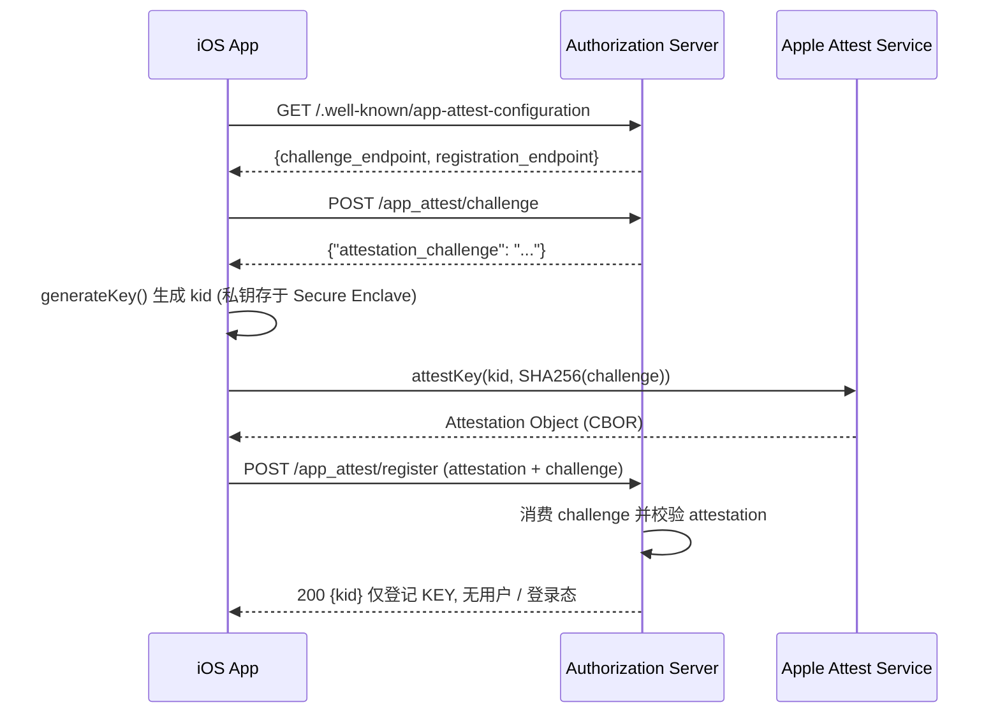

# Apple App Attest 实例注册

**App 实例注册**指: 一个 App 安装实例凭 Apple 设备证明 (App Attest) 机制, 向服务端注册**自身** —— 登记该实例的 App Attest KEY (`kid`). 注册的主体是 *App 的安装实例*, 机制是 *设备证明*; 它既不是注册用户, 也不是注册 OAuth 客户端.

> 术语区分 (同一接入流程里的两个不同步骤):
>
> | 步骤 | 端点 | 产出 | 认证 |
> |---|---|---|---|
> | **App 实例注册** (本文) | `POST /app_attest/register` | `kid` (登记 App Attest KEY) | App 实例的 attestation |
> | **OAuth 客户端注册** ([RFC 7591][RFC-7591] 动态注册) | `POST /oauth2/register` | `client_id` | 已注册 KEY 的 assertion |
>
> App 实例注册**不创建用户、不形成登录态、不产出 `client_id`**. OAuth 客户端注册在其之上进行, 见 [OAuth2 Client Registration - App Attest DYNAMIC](OAuth2-Client-Registration-%23-App-Attest-Dynamic.md).

---

## 一. 前置条件

1. **App 已在服务端登记**: 该 App 的 `teamId + bundleId` 必须已作为 [App Attest App](Model-%23-App-Attest-App.md) 由管理员登记; 否则 attestation 校验时 RP ID 无法匹配, 注册失败.
2. **服务发现**: 从 `/.well-known/app-attest-configuration` 发现 `challenge_endpoint` 与 `registration_endpoint`, 详见 [Apple App Attest 服务发现](App-Attest-Discovery.md). 下文为简洁沿用 `/app_attest/challenge`、`/app_attest/register` 简写, 实际请求以发现到的绝对 URL 为准.

---

## 二. 注册流程



iOS 侧关键三步: `generateKey()` → `attestKey()` → 提交注册.

---

## 三. 获取 Challenge `POST /app_attest/challenge`

匿名, 无需请求体.

### 响应 (200)

```json
{"attestation_challenge": "dGhpcyBpcyBhIHJhbmRvbSBjaGFsbGVuZ2U"}
```

约束:

- **一次性**: 使用后即失效, 不得缓存或跨请求复用. 每次注册前重新获取.
- **有效期 5 分钟**: 超时需重新获取.
- **提交给 Apple 的是 hash, 提交给服务端的是原值**:

  ```swift
  let clientDataHash = Data(SHA256.hash(data: challenge.data(using: .utf8)!))
  ```

  `attestKey` 接收 `clientDataHash`; 提交给 `/app_attest/register` 的是 challenge **原始字符串**, 服务端独立计算 hash 并校验.

---

## 四. 注册 `POST /app_attest/register`

本端点**以 attestation 认证 App 实例**, 非匿名: 校验 Apple App Attest attestation (证明请求来自已登记 App 的真实安装实例、持有对应私钥) 通过后, 登记该实例的 KEY. 无需 OAuth 客户端凭据或用户登录, **不创建用户, 不形成登录态, 不产出 `client_id`.**

> 本端点**幂等**: 若首次响应丢失, 客户端可用新 challenge 重新 `attestKey` 再次提交, 服务端完整校验通过后返回**既有**注册 (不重复登记, 也不报错). 被截获的 attestation 无法重放 —— 其 nonce 绑定已消费的一次性 challenge.

### 请求 (`application/x-www-form-urlencoded`)

| 参数 | 类型 | 必需 | 说明 |
|------|------|------|------|
| `attestation` | string | 是 | `attestKey()` 产物的 Base64 编码 (标准 Base64, 非 URL-safe) |
| `challenge` | string | 是 | 从 `/app_attest/challenge` 获取的 `attestation_challenge` 原始值 (非 hash) |

> `kid` **无需上传**: 服务端直接从 attestation 的 credentialId 解析得到, 并在响应中返回.

```http
POST /app_attest/register
Content-Type: application/x-www-form-urlencoded

attestation={base64}&challenge={attestation_challenge}
```

### 响应 (200)

```json
{"kid": "<Key Identifier>"}
```

> 响应中的 `kid` 与客户端 `generateKey()` 返回的 `keyId` **完全一致**. 客户端只需持久化本地 `keyId`, 无需存储或依赖本响应; 该字段仅用于确认与问题排查.

### 错误

| HTTP | `error` | 场景 |
|------|---------|------|
| 400 | `invalid_request` | 缺少 `attestation` / `challenge` |
| 401 | `registration_failed` | challenge 无效或过期, 或 attestation 校验失败 (证书链 / nonce / AAGUID / 计数器非 0 / RP ID 未匹配任何已登记 App 等) |

---

## 五. 注册之后

App 实例注册只登记 KEY, 是后续一切的前提. 之后:

1. **OAuth 客户端注册** (仅 `oauth2Enabled=true` 的 App): 携 assertion 完成 [RFC 7591][RFC-7591] 动态注册, 铸造 per-KEY `client_id`. 见 [OAuth2 Client Registration - App Attest DYNAMIC](OAuth2-Client-Registration-%23-App-Attest-Dynamic.md).
2. **取 Token**: 用户级 grant (如 OTP) + assertion 认证客户端, 或 `refresh_token` 续期. 见 [OAuth2 Client Authentication - Attestation Based - Apple App Attest](OAuth2-Client-Authentication-%23-Attestation-Based-%23-Apple-App-Attest.md).

> 注册之后的一切请求都用 **assertion** (而非 attestation): attestation 每个 KEY 正常只提交一次.

---

## 相关文档

- [Apple App Attest 服务发现](App-Attest-Discovery.md) — 端点发现
- [OAuth2 Client Registration - App Attest DYNAMIC](OAuth2-Client-Registration-%23-App-Attest-Dynamic.md) — OAuth 客户端动态注册
- [OAuth2 Client Authentication - Attestation Based - Apple App Attest](OAuth2-Client-Authentication-%23-Attestation-Based-%23-Apple-App-Attest.md) — token 端点的 assertion 客户端认证
- [App Attest App](Model-%23-App-Attest-App.md) — 应用模型与 `oauth2Enabled` 语义

[RFC-7591]: https://datatracker.ietf.org/doc/html/rfc7591
