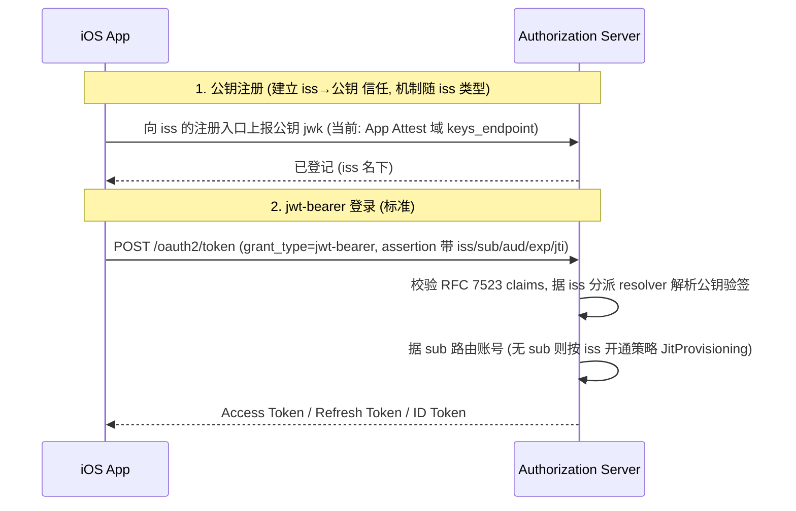

# JWT Bearer — 服务端设计

> 分工: 接入细节面向**客户端开发者**, 只讲协议与可观察行为; 本文面向**服务端实现者与架构评审**, 讲如何实现标准 jwt-bearer 链路、可扩展的 iss 信任模型、数据模型与决策记录. 客户端可见契约以接入细节为准.

---

## 一. 范围与定位

- **目标**: 实现**标准 jwt-bearer 授权 grant**(`urn:ietf:params:oauth:grant-type:jwt-bearer`, RFC 7523)——客户端用一把**已注册公钥**对应的私钥签发 JWT 断言, AS 验签后签发 Token. 本文讲的是**如何实现这条标准链路**, 而非某个专有 grant.
- **iss 是可插拔的信任锚(核心)**: jwt-bearer 的信任完全系于断言的签发者 `iss`——AS 据 `iss` 解析验签公钥、并据 `iss` 的**类型**决定"是否允许无 `sub` 开通"与"保证级别". 因此把 **iss 的信任解析抽象为一个扩展点**(见〈三〉), provider 主流程与具体 iss 类型无关.
- **当前仅实现一种 iss**: **App Attest App 实例**(`iss` = 该实例的 `client_id`). 它的公钥注册走"设备证明 + 自助注册"、保证级别低, 故**当前仅用于匿名 / 试用**. 该抽象对**高安全 iss**(可信 IdP / 实名签发方)开放, 接入后**同一套 jwt-bearer 链路即可作正式身份认证**, 无需改 provider(见〈三.3〉).
- **身份载体**: `identity_type = public_key`(承载用户公钥的身份); 与 iss 类型正交.

---

## 二. 标准 jwt-bearer 链路(实现主线)

整条链路只有两步, 都围绕"iss → 公钥"这一标准信任关系:

1. **公钥注册(建立 iss→公钥 信任)**: 把用户公钥登记到某个 `iss` 名下. **注册机制由 iss 类型决定**——当前 App Attest iss 用带外注册端点(〈六〉); 未来的 IdP iss 则用其自有 JWKS / 联邦, 不经本服务端点.
2. **jwt-bearer 登录(标准)**: 客户端提交断言(`iss`/`sub`/`aud`/`exp`/`iat`/`jti` + header `alg`/`kid`), AS: 校验 RFC 7523 §3 各 claim → **据 `iss` 分派到对应 resolver 解析公钥验签**(〈三〉〈七.1〉) → **据 `sub` 路由账号**(〈四〉) → 签发 AT/RT/id_token. 断言**无 `sub`** 时, 是否开通新账号由该 iss 的开通策略决定(〈七.3〉).



---

## 三. 可扩展的 iss 信任模型(核心扩展点)

### 3.1 抽象: `JwtBearerIssuerResolver`(SPI)

provider 主流程**不认识任何具体 iss 类型**, 只经一个 resolver 链(仿 `DelegatingUserIdentityService` / `ClientAuthenticationMechanismExtractor` 的链式分派)按 `iss` 选中一个实现. 每个 resolver 负责:

| 职责 | 说明 |
|---|---|
| `supports(iss, clientPrincipal)` | 是否认领该 `iss`(如"iss == 本次已认证的 App Attest 客户端") |
| `resolveKey(iss, kid)` | 解析验签公钥(该 iss 名下、`kid` 对应的 `jwk`) |
| `provisioningPolicy()` | 是否允许**无 `sub` 开通**(JitProvisioning)及其准入 |
| `assuranceLevel()` | 该 iss 的保证级别(低=设备证明 / 高=实名 IdP), 供上层策略与审计 |

新增一种 iss = **新增一个 resolver 实现 + 配置**, 不改 jwt-bearer provider(开闭原则).

### 3.2 当前实现: App Attest App 实例 iss

- `iss` = 该 App 实例的 `client_id`; `supports` = 断言 `iss` == 本次 App Attest 客户端认证出的 `client_id`.
- `resolveKey`: 查**可信密钥登记表** `(iss, kid) → jwk`(由 App Attest 域注册端点登记, Apple attestation 为信任根, 见〈五〉〈六〉).
- `provisioningPolicy`: **允许**无 `sub` 开通(JitProvisioning), 但要求本次客户端认证机制 ∈ `public_key` 白名单(`attest_appattest_client_auth`).
- `assuranceLevel`: **低**(仅证明真机正版 App 生成了该钥, 不核验用户本人)→ 定位为匿名 / 试用.

### 3.3 未来扩展: 高安全 iss(可信 IdP / 实名签发方)

- `iss` = 外部签发方标识; `resolveKey`: 从该签发方的 **JWKS**(联邦 / OIDC Discovery / 管理端带外登记)取公钥——**不经本服务注册端点、不写可信密钥登记表**.
- `provisioningPolicy`: `sub` **必填**(对应用户已存在于签发方), **不匿名开通**.
- `assuranceLevel`: **高** → 该 jwt-bearer 登录即可作**正式身份认证**.
- 接入成本: 一个 resolver 实现 + 信任的 issuer 配置; provider、身份寻址、数据模型**全不变**.

> 这套抽象把"信任从哪来"收敛到 resolver, 使 jwt-bearer 链路对 iss 类型中立: 今天用低保证的 App Attest iss 做匿名试用, 明天挂高保证 IdP iss 做正式认证, 是同一条标准链路的两种 iss 实现.

---

## 四. 领域模型与身份寻址(承袭 Route A, 与 iss 无关)

### 4.1 `public_key` 是 `UserIdentityService` 的一个后端
`PublicKeyUserIdentityService extends AbstractUserIdentityService`, `identityType()` 返回 `public_key`, 纳入 `DelegatingUserIdentityService` 路由; 与 `phone` / `email` / `google` 并列; 特有数据只有单把公钥(`jwk`).

### 4.2 账号由 `sub`(用户名)路由; 身份与 iss/kid/client_id 解绑
登录断言 `sub` = **账号用户名**(`EulerUserDetails.getUsername()`). 服务端 `loadUserByUsername(sub)` → `user_id` → `listUserIdentities(user_id, "public_key")`. 身份自有独立 `subject`(公钥指纹派生, 逐身份不同, ≠ 账号 `sub`). **登录验签一律走身份域(public_key 身份), 不回查 iss 登记表**——故身份不耦合到 `iss`/`kid`/`client_id`, App Attest `kid` 吊销 / 重注册不使身份失效(见〈十一〉).

### 4.3 禁止复用废弃的设备→用户映射
不得复用 `app_attest_attestation_user_mapping` / `EulerDeviceUserDetailsService` / `OAuth2AppAssertionAuthenticationProvider`(均 `@Deprecated`). 客户端认证只是**注册 / 登录 / 开通的准入门槛**, 不作为用户身份.

---

## 五. 数据模型

```text
t_app_attest_issued_key   (可信密钥登记表; App Attest iss 专用; 表名示意)
  iss            = 签发者(该 App 实例的 client_id)
  kid            公钥标识
  jwk            公钥材料
  created_at
  -- 唯一 (iss, kid); 无用户语义; 仅供 App Attest iss 首次开通时解析验签公钥
  -- 注: 其他 iss 类型(如 IdP)有自己的公钥来源(JWKS), 不写此表

t_user_identity  (既有父表, 不新增列; iss 无关)
  identity_id (PK), user_id, identity_type='public_key', subject, bound_at
  -- subject = 公钥指纹(RFC 7638 JWK Thumbprint), (identity_type, subject) 唯一约束
  --            跨账号唯一、逐身份不同; ≠ 账号 username(token sub)

t_user_identity_public_key  (1:1 单行子表; iss 无关)
  identity_id   PK, FK → t_user_identity.identity_id
  jwk / kid / origin_client_auth(审计, 可空) / created_at
```

- **两套存储解耦**: 可信密钥登记表(iss 域, 注册端点写, **仅首次开通**解析用) vs `public_key` 身份(用户域, **登录**验签用). 二者都存 `jwk`(冗余但解耦), 关联仅靠公钥指纹, 不互相外键. 若登录也走登记表验签, 身份就重新耦合回 iss/kid, 违背〈四.2〉.
- **1 身份 = 1 公钥**: 不支持轮换, `jwk` 只读; 换钥即换号, 旧号孤儿(见〈十一〉).
- **并发唯一键**: `(identity_type, subject)` 唯一约束是首次开通的**原子串行化点**(见〈七.3〉).

---

## 六. 公钥注册端点(当前 = App Attest iss 的注册机制)

> 本节是 **App Attest iss 这一实现**的公钥登记入口; 换成 IdP iss 时公钥来自其 JWKS, 无本端点(见〈三.3〉).

### 6.1 发现与归属
- 经 **App 安装实例认证服务**的 `.well-known/app-attest-configuration` 自定义成员 `keys_endpoint` 发现; 默认 RESTful 复数路径 `POST /app_attest/keys`(集合语义, 一个 App 实例可注册多把).
- **归 App Attest / 签发者域**(不挂 openid-configuration): 注册**无用户语义**, 只是"经 App Attest 认证的 App 实例(iss)登记一把它签发的公钥". 命名避让 OIDC/RFC 7591 的 `registration_endpoint`(客户端注册).

### 6.2 注册流程
1. 经 **App Attest 域客户端认证**(assertion + kid + challenge, 承载解析见 `AppAttestCredentialResolver`)取已认证客户端 → `client_id`(即该密钥的 `iss`); 未认证直接拒. assertion 不含 kid, 故 `kid` 必传.
2. 体携公钥 `jwk`; 取 / 派生 `kid`.
3. 写入可信密钥登记表 `(iss, kid, jwk)`; 幂等按 `(iss, kid)` 或公钥指纹.
4. 返回 `201` + **完整已注册 jwk(含 `kid`)**.
5. **不建账号、不触发 JitProvisioning**(那是首次登录的事, 见〈七.3〉).

> **注册不强制 proof-of-possession**: 私钥不可导出, 持有证明自然发生在首次登录(验签); 注册仅登记公钥, 由 App Attest 门禁 + 限频防刷.

---

## 七. 登录: jwt-bearer provider(标准主流程 + iss 分派)

Spring Authorization Server **无内置 jwt-bearer provider**(服务端仅到 token-exchange), 故自实现 converter + provider, 注册到 `OAuth2AuthorizationGrantType.JWT_BEARER`.

### 7.1 通用主流程(iss 无关)
1. 取已认证客户端(若有); 解析 `assertion`(JWS): header `alg`+`kid`, payload `iss`/`aud`/`exp`/`iat`/`jti`(+ `sub`).
2. 校验 RFC 7523 §3: `aud` = token 端点; `exp` 未过期(含时钟偏移); `jti` 经 `NonceService` 拒重用; `iat` 在窗内.
3. **据 `iss` 选中 resolver**(〈三〉), 由它 `resolveKey(iss, kid)` 取公钥并按 `alg` 分派 nimbus 验签器(`ECDSAVerifier`/`RSASSAVerifier`/`Ed25519Verifier`)验签.

### 7.2 有 `sub`(常规登录)
- `loadUserByUsername(sub)` → `user_id`(无此用户 → `invalid_grant`); `listUserIdentities(user_id, "public_key")`, header `kid` 在多身份时选钥.
- 用**身份域(public_key 身份)** 的 `jwk` 验签(**不回查 iss 登记表**, 保持解绑).
- **独占校验**(〈八〉: 该 `user_id` 身份须全为 `public_key`), 否则 `invalid_grant`.
- 签发 AT/RT/id_token(`sub` = 该用户名).

### 7.3 无 `sub`(首次开通)
- **仅当选中 resolver 的 `provisioningPolicy` 允许**(当前只有 App Attest iss 允许; 标准/高安全 iss 要求 `sub` 必填, 无 `sub` 直接 `invalid_grant`).
- 派生 `subject`(公钥指纹); 查 `public_key` 身份:
  - **已存在** → 落到该账号, 按登录处理(幂等).
  - **不存在** → **一个事务内**建 user(自动生成用户名 = `sub`) + 建 `public_key` 身份(唯一 `subject`). **并发**: 同公钥、无 `sub` 的两请求同时到达时, `(identity_type, subject)` 唯一约束只放行一个 insert, 另一个撞约束 → **整事务回滚**(含其 user) → 捕获后**重查**落到赢家账号、按登录签发. **不加额外锁**.
- 签发 Token(`sub` = 新用户名); 客户端从 Token 解析 `sub` 持久化.

---

## 八. 独占约束

`public_key` 身份只允许存在于**无任何其他身份**的账号上. 只在 `public_key` 侧两处强制:
- **绑定侧** — `PublicKeyUserIdentityService.createUserIdentity(...)`: 校验目标账号当前无任何身份.
- **认证侧** — provider: `listUserIdentities(userId)` 须**全部为 `public_key`**, 否则 `invalid_grant`.

效果: 账号绑定其他用户身份后, 认证侧立即拒绝 jwt-bearer 登录, **无需删除** `public_key` 身份数据.

---

## 九. 凭证格式与算法

- **`assertion` = JWS**(RFC 7515): header `alg` + `kid`; payload `iss` + `sub`(登录时) + `aud` + `exp` + `iat` + `jti`. 除"首用无 `sub`"这一**由 iss 开通策略 gated 的扩展**外, 符合 RFC 7523 §3.
- **多算法**: EC P-256 / RSA / Ed25519; 单把公钥用一个 JWK(RFC 7517); 按 `alg` 分派 nimbus 验签器.
- **域分离**: `assertion` 新鲜性(`jti`+`exp`+`iat`+`aud` + `NonceService`)不复用 App Attest challenge, 两层信任独立.
- **无 `signCount`**: `jti` 防重放已足够.

---

## 十. 决策记录 (ADR 摘要)

| 议题 | 选择 | 理由 / 否决项 |
|---|---|---|
| grant 选型 | **标准 `jwt-bearer`(RFC 7523)** | 少造非标、链路可审计; 否决旧自定义 `user_assertion`(非标, Spring 亦无内置 provider, 自写成本相同却少了标准形状) |
| **iss 建模** | **抽象为可插拔 `JwtBearerIssuerResolver`(信任锚)** | provider 与 iss 类型解耦; 当前 App Attest(低保证/匿名), 未来 IdP(高保证/正式)只需加 resolver. 否决把 App Attest 逻辑焊进 provider |
| `iss` 取值(当前) | **= 该 App 实例的 `client_id`** | RFC 7523 里 iss 对应"其密钥签了断言的签发者"; 公钥登记在 iss 名下, 故 iss=App 实例名副其实, 且可校验 `iss==已认证 client`. 否决 `iss=sub 自签`、`iss=设备/kid`(kid 随吊销变) |
| 注册端点归属 | **App Attest 域** `keys_endpoint`(RESTful 复数 `/app_attest/keys`), 无用户语义, 响应完整 jwk | 注册是"iss 登记其签发公钥"=签发者/设备域; 否决挂 openid-configuration、否决复用 `registration_endpoint` |
| 两套存储 | 可信密钥登记表(iss 域) 与 public_key 身份(用户域) 分离 | 否则登录验签把身份耦合回 iss/kid; 登记表只服务开通, 身份只服务登录 |
| 建号方式 | **首次无 `sub` → JitProvisioning**, 由 iss 的 `provisioningPolicy` 把关 | 不做独立 `POST /user`(无用户 AT, 鸡生蛋); 标准/高安全 iss 不受影响(sub 必填) |
| 并发开通 | **(identity_type, subject=公钥指纹) 唯一约束** + 事务回滚 + 重解析落登录 | 用户明确不必额外加锁; 唯一约束即原子闸 |
| 多设备 | 匿名号**事实单设备**(sub 只在原设备本地) | 收窄低保证账号滥用面; 升级后可在新设备用其他身份登录再绑新公钥 |
| `identity_type`/不轮换 | `public_key` / 单把 `jwk` 只读 | 承袭 Route A |

---

## 十一. 后果与边界

- **App Attest `kid` 吊销 → 重注册**: 重注册得新 `client_id`(新 `iss`), 需在**新 iss 下重新登记同一把用户公钥**(私钥不变); 账号 `sub` 与私钥未变, 故账号可恢复、数据无损. 身份不随 iss/kid 失效(〈四.2〉).
- **事实单设备 / 可恢复性**: 登录需同时持有私钥(验签)与 `sub`(路由). 匿名号 `sub` 只在原设备, 换机取不回 → 换机即新开通; 私钥不可导出、不随迁. 二者能否跨退出留存取决于客户端生命周期策略(默认 `session`; 可选保留, 见接入文档〈八〉).
- **无轮换 → 换钥即换号**: 丢私钥只能生成新密钥对、重走注册 + 开通 → 新账号, 旧号孤儿.
- **滥用防护**: 注册与开通均受**已认证客户端**门槛 + JitProvisioning 白名单; 限频按"已认证客户端"维度.
- **Spring 无内置 jwt-bearer provider**: converter + provider 自实现(照 RFC 7523), 无框架现成实现可复用.

---

## 十二. 落地清单 (非本文强约束)

- **iss 扩展点**: `JwtBearerIssuerResolver` SPI + 链式分派; 首个实现 `AppAttestIssuerResolver`(iss=client_id、查登记表取钥、允许 JitProvisioning、低保证). 预留高安全 iss 实现位.
- 领域: `PublicKeyUserIdentityService`(含 `createUserIdentity` 独占校验; 登录经 `loadUserByUsername` + `listUserIdentities(userId, "public_key")`; `findUserIdentityByRawSubject("public_key", 公钥指纹)` 供开通判重).
- 持久化: 可信密钥登记表 `(iss, kid, jwk)` + `t_user_identity_public_key`(身份键 = 父表 `subject`, `(identity_type, subject)` 唯一约束).
- 注册端点: `keys_endpoint`(App Attest 域, Filter + JSON; 体收 `jwk`、响应回完整 jwk) + 在 `app-attest-configuration` 暴露该成员; App Attest 客户端认证门禁.
- 授权服务: jwt-bearer 的 converter + provider(注册到 `OAuth2AuthorizationGrantType.JWT_BEARER`; 主流程校验 RFC 7523 claims + 据 iss 分派 resolver 验签; 有 sub → 身份域路由; 无 sub → resolver 开通策略 + 唯一约束并发). **不新增** `EulerAuthorizationGrantType` 自定义常量.
- JitProvisioning: `JitProvisioningPolicy.allowedClientAuthenticationMethods` + `ClientAuthenticationMechanismExtractor` + `JitProvisioningGuard`, 闸门落在**首次开通点**.
- `public_key` 身份**只读**: 无轮换, **不接入** `PUT /user/identities/{identity_id}`; 更换密钥走重新注册 + 开通.

---

## 十三. 相关文档

- [JWT Bearer 接入细节](App-Attest-Login-%23-Jwt-Bearer.md) — 面向客户端的协议与行为(本文的对外契约面)
- [Apple App Attest 登录完整流程文档](App-Attest-Login.md) — 上位文档
- [Apple App Attest 服务发现](../../App-Attest-Discovery.md) / [Apple App Attest 实例注册](../../App-Attest-Registration.md) — App Attest 域发现与 App 实例注册
- [Attestation Based Client Authentication (Apple App Attest)](../../OAuth2-Client-Authentication-%23-Attestation-Based-%23-Apple-App-Attest.md) — 客户端认证(注册 / 登录 / 开通门禁)
- [绑定用户身份](../../APIs-%23-User-Identities-Create.md) — 身份 CRUD(`public_key` 只读, 不经更新接口)
- [RFC 7523](https://www.rfc-editor.org/rfc/rfc7523) / [RFC 8414](https://www.rfc-editor.org/rfc/rfc8414) / [RFC 7638: JWK Thumbprint](https://datatracker.ietf.org/doc/html/rfc7638) / [RFC 7515: JWS](https://datatracker.ietf.org/doc/html/rfc7515) / [RFC 7517: JWK](https://datatracker.ietf.org/doc/html/rfc7517)
