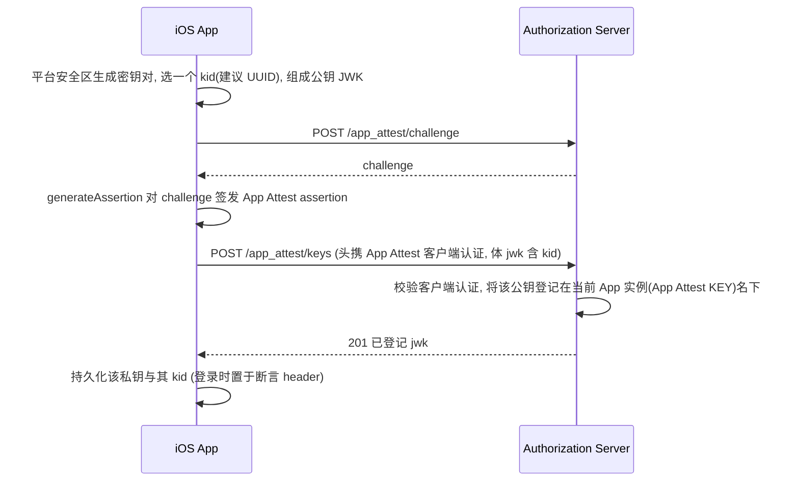
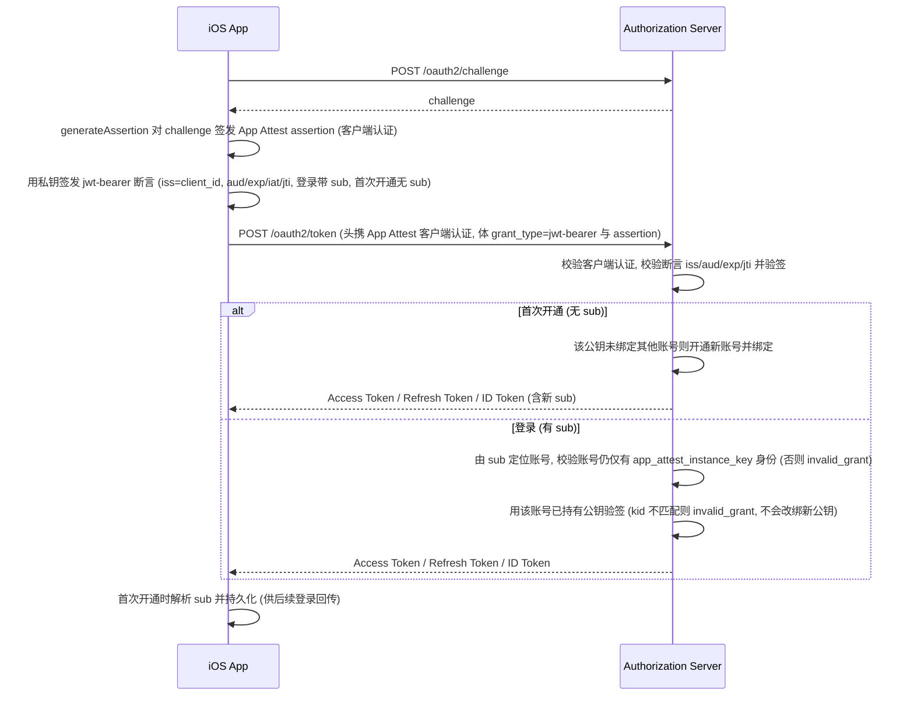

# App Attest 登录 - JWT Bearer 接入细节

本文档是 [App Attest 登录完整流程](App-Attest-Login.md) 的附录, 描述以**标准 OAuth jwt-bearer 授权 grant**(`urn:ietf:params:oauth:grant-type:jwt-bearer`, RFC 7523)申请 Token 的客户端接入契约.

jwt-bearer 是一种**通用且符合标准**的 Token 申请方式: 客户端用一把**已注册公钥**对应的私钥签发 JWT 断言, 服务端据断言的签发者 `iss` 解析出对应公钥验签, 通过后签发 Token. 其**信任强度取决于 `iss`(签发者)的可信等级**, 与 grant 本身无关.

本文落地的 `iss` 是**经 App Attest 认证的 App 实例**; 密钥注册阶段采用"设备证明 + 客户端自助注册公钥"这一**相对低保证**的方案(信任止于"这把公钥确由真机上的正版 App 生成", 不含用户身份核验), 因此**当前仅用于匿名试用**(局限详见下). 将来若接入**高安全等级的 `iss`**(如可信 IdP / 实名签发方), 同一套 jwt-bearer 登录**无需改动协议**即可直接用作**正式身份认证机制**.

用户无需手机号 / 邮箱 / 第三方账号. 总流程、抽象概念、持久化、退出登录等见上位文档.

> **适用约束**: `app_attest_instance_key` 身份只能用于**未绑定任何其他类型用户身份**的账号 —— 账号一旦绑定了其他类型用户身份(手机 / 邮箱 / IdP), 本身份登录即失效(见〈六〉). 因此它通常用于**匿名试用**阶段: 用户先静默开通一个账号试用, 之后再绑定用户身份转为正式账号.
>
> **局限(接入前务必知悉)**: 本方式账号**保证级别低**, 只宜用于试用 / 低敏感场景.
> - **不核验任何用户身份**: 注册只验证**客户端**(经 App Attest 证明为合法 App 安装实例), **不核验用户本人** —— 不同于 OTP 验证手机 / 邮箱、IdP 验证第三方账号. 这正是称其为"匿名"的原因.
> - **无第二认证因素 + 事实单设备**: 登录只证明"持有注册时登记的那把私钥". 私钥在平台安全区不可导出、不随迁; 且匿名账号的 `sub` 只在原设备本地, 换机无从取回, 故匿名账号**事实上是单设备的**(见〈九〉)——这也正好收窄了低保证账号的滥用面.
>
> 本文只讲**客户端接入**(协议、请求 / 响应、客户端职责与可观察行为).

---

## 一. 接入主线与概念映射

接入 jwt-bearer 只有两步: **① 把用户公钥注册到本 App 实例名下**, **② 用对应私钥签发 jwt-bearer 断言登录**(断言 header 带 `kid`、payload 带 `sub`). 本文的 `iss` **当前仅支持经 App Attest 认证的 App 实例**(`iss` = 其 `client_id`), 保证级别低、用于匿名试用; 未来接入高安全 `iss`(如可信 IdP)后, 同一套 jwt-bearer 登录即可用作正式身份认证.

下表把总文档抽象映射到本方式:

| 总文档抽象 | 本方式落地 |
|---|---|
| `<user_grant>` | **标准** `urn:ietf:params:oauth:grant-type:jwt-bearer`(RFC 7523), 非自定义 grant |
| `<credential>` | `assertion` —— 用户私钥签名的 **JWS**(RFC 7523 规定的参数名; 构成见〈三〉) |
| `identity_type` | `app_attest_instance_key` |
| 断言签发者 `iss` | **该 App 实例的 OAuth `client_id`**(即经 App Attest 认证的可信签发者); 用户公钥按该 App 实例登记 |
| 唯一标识 `sub` | 账号 `sub`(= 用户名): **首次登录(开通)时由服务端签发的 Token 带回**, 客户端解析并持久化, 之后每次登录在断言 `sub` claim 回传 |
| CP(Credential Provider) | 用户本人(持有私钥的设备); 私钥由平台安全区(iOS Secure Enclave / Android Keystore)保管, 不可导出 |

> **两把独立密钥 / 两种凭证勿混**: 请求头承载的 **App Attest 客户端认证**(证明 *App 实例*, 用 App Attest `kid` 的私钥); 请求体 `assertion` 是 **用户凭证**(证明 *用户*, 用 `app_attest_instance_key` 身份的私钥签发). 两把密钥互相独立, 各自的 `kid` 仅同名、分属不同命名空间.

---

## 二. 前置条件与服务发现

1. **App 实例注册 + OAuth2 客户端注册**: 先取得 App Attest `kid` 与 `client_id`(见上位文档〈三.1〉〈三.2〉). 注册公钥与登录两步都**叠加 App Attest 客户端认证**.
2. **发现公钥注册端点**: 从 **App 安装实例认证服务**的 well-known 元数据获取(公钥注册属 App Attest 域 —— 它是"可信 App 实例登记自己签发的密钥", 无用户语义):

   ```http
   GET {issuer}/.well-known/app-attest-configuration
   ```

   读取其中的 `keys_endpoint` 字段即为公钥注册端点(默认 `POST /app_attest/keys`; RESTful 复数集合, 一个 App 实例可注册多把公钥).

> ⚠️ `keys_endpoint` 是本文档体系在 `app-attest-configuration` 中新增的自定义成员, 与既有的 `challenge_endpoint`、`registration_endpoint`(App **实例**注册)并列; 它注册的是**App 实例自备的公钥**(本文用它做 jwt-bearer 登录), 不要与 `registration_endpoint` 或 OIDC 的 `registration_endpoint`(RFC 7591 客户端注册)混淆.

---

## 三. 凭证模型: `app_attest_instance_key` 身份的密钥

`app_attest_instance_key` 身份的用户凭证是**一把非对称密钥**, 与 App Attest 的 `kid` **完全独立**.

- **算法**: 服务端接受 **EC**(ES256 / ES384 / ES512) 与 **RSA**(RS / PS 系列) 两类公钥. iOS 上**请直接用 Secure Enclave 生成的 EC P-256 (ES256)** —— 它是唯一能把私钥真正锁在安全区、不可导出的选择, 也是本方式"持有私钥即在原设备"这一保证的来源; Keychain 软件钥与 CryptoKit 的 Curve25519 私钥均可导出, 会削弱该保证. **Ed25519 目前不接受**(注册即报错), 原因同上.
- **公钥表达**: 一个标准 **JWK**(RFC 7517)(`kty` / `crv` / `x`,`y` | `n`,`e` / `alg`, 以及**必填的 `kid`**). 对称密钥(`kty=oct`)、私钥成员、缺 `kid`、以及上述两类之外的 `kty` 都会在注册时被拒.
- **`kid` 由客户端指定**: 注册时写在 body 的 JWK 里, 它就是这把公钥的标识, 之后每次登录的断言 header 必须原样回传. 服务端不派生也不改写它, 只要求**必填、全局唯一、不超过 128 字符、不含控制字符**. **建议用 UUID**(每生成一把密钥对就新生成一个): `kid` 全局唯一, 被占用后任何人都不能再用, 而 UUID 不会撞上. 登记之后 `kid` 与该公钥的对应关系不可变.
- **公钥固定不可改**: 公钥在注册时登记, 之后不可修改; 对应私钥一旦丢失, 该账号即无法再登录.
- **私钥**: 平台安全区生成并保管, **不可导出**, 服务端只存公钥. 因不可导出, 能签出合法断言即意味着"就在注册它的那台设备上".

### 断言形态 (RFC 7523 jwt-bearer)

登录用的 `assertion` 是一个 **JWS**(RFC 7515), 用 `app_attest_instance_key` 身份的私钥签名:

- **header**: `alg` + `kid`(= 注册时你自己指定的那个). **`kid` 必填**(首次开通与带 `sub` 登录都一样), 缺失即 `invalid_grant`.
- **payload**: `iss`(= 该 App 实例的 `client_id`) + `aud` + `exp`(过期时刻) + `iat`(签发时刻) + `jti`(每次唯一) **均必填**; `aud` 取**本服务的 token 端点绝对 URL** 或其 **issuer** 二者之一; **登录时还须含 `sub`(用户名), 首次开通时无 `sub`**(见〈五〉).
- 服务端会拒绝: 缺 `kid`、签名不匹配、`alg` 与公钥类型不符、`iss` 与本次客户端认证不符、缺 `aud`/`exp`/`iat`/`jti`、`exp` 已过期、`iat` 超出可接受窗口、`aud` 不指向本服务、`jti` 重用、`kid` 在该账号名下不存在.

> `iat` 与 `jti` 在 RFC 7523 中为可选, 本服务**强制要求**: 前者限定一张断言的可重放窗口, 后者使其一次性. 断言有效期不宜过长(建议数分钟), `iat` 过早的断言会被当作过期拒绝.

> ⚠️ **不要据 `error_description` 分支.**
> - **带 `sub` 登录**: 凡涉及账号或公钥的拒绝一律返回同一句 `the assertion does not authenticate`(账号不存在、账号没有这把 `kid`、签名不匹配、账号已绑定其他类型身份、该 `kid` 未登记). 收到 `invalid_grant` 按**单一失败**处理, 不重试、不据它推断账号状态.
> - **不带 `sub`(首次开通)**: `kid` 未登记会给出具体原因; "不许开通账号"(策略关闭, 或本次客户端认证方式不允许开通)仍返回上面那一句.
> - **两条路径都给出具体原因、可据此修正请求的**: 缺 `kid` 头、缺 claim、`exp` 已过期、`iat` 超窗、`aud` 不指向本服务、`jti` 重用、`iss` 与本次客户端认证不符.

---

## 四. 注册公钥 (App Attest 域, 带外, 无用户语义)

首次使用先注册公钥. 客户端在安全区生成密钥对, 经 App Attest 客户端认证向公钥注册端点(默认 `POST /app_attest/keys`)上报公钥 `jwk`; 服务端把它登记在**认证本次请求的那个 App Attest KEY(App 实例)**名下, 返回完整已注册 jwk. 本端点**只登记密钥、不涉及任何用户 / 账号**——账号在首次登录时开通(见〈五〉).

> **前置**: 该 App Attest KEY 已完成 [App 实例注册](../../App-Attest-Registration.md) 即可, 本端点**不要求**已完成 OAuth 客户端动态注册. 但登录时断言的 `iss` 必须取该 KEY 绑定的 `client_id`, 故**登录前**仍需完成 [OAuth 客户端动态注册](../../OAuth2-Client-Registration-%23-App-Attest-Dynamic.md).
>
> **客户端认证承载**: 用 `App-Attest-Kid` / `App-Attest-Challenge` / `App-Attest-Assertion` 请求头. assertion 不含 kid, 故 `kid` 必传(见 [Apple App Attest 实例注册](../../App-Attest-Registration.md)).
>
> **请求体**: 整个 JSON 体就是一把公钥 JWK(不带外层包装), **必须含 `kid`**. 只应携公钥成员; 携了私钥成员会被剔除后才登记. 请求体有大小上限(远大于任何可登记的公钥 JWK), 超出即 `400`.

请求示例:

```http
POST /app_attest/keys
Content-Type: application/json
App-Attest-Kid: {kid}
App-Attest-Challenge: {challenge}
App-Attest-Assertion: {Base64(App Attest Assertion)}

{ "kty": "EC", "crv": "P-256", "x": "...", "y": "...", "alg": "ES256", "kid": "{你为这把公钥选的 kid}" }
```

响应 (201) —— 已登记的 jwk, 即你提交的那把公钥(私钥成员已剔除), `kid` 原样保留:

```json
{ "kty": "EC", "crv": "P-256", "x": "...", "y": "...", "alg": "ES256", "kid": "{你为这把公钥选的 kid}" }
```

错误响应:

| HTTP | `error` | 含义 |
|---|---|---|
| 400 | `invalid_request` | 缺凭据头或请求体; 请求体过大; 请求体不是可登记的 JWK(不是 JWK / 对称密钥 / 不支持的 `kty`); 或缺 `kid`、`kid` 超长、`kid` 含控制字符 |
| 401 | `key_registration_failed` | challenge 无效或已消费, 或 assertion 验签失败 |
| 409 | `kid_already_registered` | 该 `kid` 已被登记. 换一个新的 `kid` 重新登记; 若确信这是你自己的重试, 则该公钥已登记成功, 直接用原 `kid` 登录即可 |

时序图:



> - **可注册多把**: 同一 App 实例可多次 `POST /app_attest/keys` 注册多把公钥(集合语义). 但注意**一个账号只能有一把**(见〈六〉): 多注册一把不会让它追加到已有账号上, 用它做无 `sub` 登录只会开通另一个新账号.
> - **不幂等**: `POST` 语义. 同一 `kid` 再次登记一律 `409`, **即使提交的是同一把公钥** —— 服务端不会用新提交覆盖已登记的行. 因此客户端要把 `kid` 与私钥一并持久化, 不要指望"重发一次把 `kid` 拿回来": `kid` 是你自己选的, 你本来就知道它, 响应丢了也可以直接用它登录.
> - **不要求持有证明**: 注册时不需要额外证明你持有对应私钥 —— 私钥不可导出, 持有证明自然发生在首次登录(验签)时. 防刷依靠 App Attest 门禁与限频.

---

## 五. 登录 (标准 jwt-bearer)

注册公钥后即可登录. 首次登录**不带 `sub`** → 服务端**开通**一个匿名账号并在 Token 里带回 `sub`; 之后登录**带 `sub`** → 常规登录. 两者都叠加 App Attest 客户端认证.

### 5.1 首次登录(开通, 断言无 `sub`)

```http
POST /oauth2/token
Content-Type: application/x-www-form-urlencoded
App-Attest-Kid: {kid}
App-Attest-Challenge: {challenge}
App-Attest-Assertion: {Base64(App Attest Assertion)}

grant_type=urn:ietf:params:oauth:grant-type:jwt-bearer
&assertion={JWS: 头 alg+kid, payload 含 iss/aud/exp/iat/jti, 无 sub}
&scope=openid
```

服务端验签通过后**开通新账号**并签发 Token; **`sub` 从返回的 Access Token / ID Token 解析并持久化**, 供后续登录回传.

### 5.2 后续登录(断言带 `sub`)

```http
POST /oauth2/token
Content-Type: application/x-www-form-urlencoded
App-Attest-Kid: {kid}
App-Attest-Challenge: {challenge}
App-Attest-Assertion: {Base64(App Attest Assertion)}

grant_type=urn:ietf:params:oauth:grant-type:jwt-bearer
&assertion={JWS: 头 alg+kid, payload 含 iss/sub/aud/exp/iat/jti}
&scope=openid
```

> **一个账号只有一把公钥**: 带 `sub` 登录时, `kid` 必须指向该账号**已持有**的那把公钥. 指向一把该账号没有的公钥会被拒绝, 即使那把公钥已由本 App 实例注册、签名也确实有效 —— 服务端**不会**把它追加到该账号上. 原因见〈六〉.

时序图:



> `assertion` 的新鲜性由自带 `jti`+`exp`+`iat`+`aud` 保证, 与 App Attest 客户端认证的 `challenge` **各自独立**、互不复用.

---

## 六. 约束: 独占账号

`app_attest_instance_key` 身份受两条约束, 都是服务端强制的:

- **不与其他类型身份共存**: 账号一旦绑定了任何**其他类型用户身份**(手机 / 邮箱 / IdP), **jwt-bearer(`app_attest_instance_key`) 登录随即失效**, 服务端返回 `invalid_grant`; 此后该账号改用该身份登录, 数据无损. 因此绑定后**无需**删除 `app_attest_instance_key` 身份数据(留着也无法再用于本方式登录).
- **一个账号只有一把公钥**: 开通时登记的那把就是唯一一把, 之后**不能追加第二把**, 也不能更换(无轮换). 带 `sub` 登录时若 `kid` 不是该账号已持有的那把, 一律 `invalid_grant` —— 即使这把公钥确实已由本 App 实例注册、签名也确实由它产生.

> 第二条的理由是 **`sub` 不是机密**: 它就是账号的用户 ID(用户名), 随每一个 Access Token 下发、被 App 访问的每个资源服务看到(见〈八〉). 若"知道 `sub` + 持有任意一把已注册公钥的私钥"就能把公钥追加到账号上, 那 `sub` 就等于账号凭据 —— 而公钥那一半任何能在真机上跑正版 App 的人都能自备. 所以服务端不接受这种追加, 让**私钥保持为唯一凭据**.
>
> 代价是明确的: **私钥丢失即账号不可恢复**(换机、重装导致安全区密钥消失都算). 客户端应据此定位匿名试用账号能存什么: 需要长期保留的数据, 应在绑定正式身份之后再产生.
>
> 注意 App Attest `kid` 被吊销后仍可恢复: 重新注册 App 实例得到新 `client_id`、并**重新登记一次公钥**后, 用原私钥即可登录原账号(见〈九〉).

> 绑定用户身份的流程见 [短信 / 邮箱 OTP 接入细节 · 绑定场景](App-Attest-Login-%23-OTP.md#三-绑定场景-账号追加手机--邮箱绑定).

---

## 七. `identities` 中 `app_attest_instance_key` 元素结构

作为 `identities` 列表中 `identity_type=app_attest_instance_key` 的元素, **只有公共字段**(详见[总文档 4.3 用户身份数据](App-Attest-Login.md#43-用户身份数据-identities)), 无任何本类型特有字段:

```json
{
  "identity_id": "1b9d6bcd-bbfd-4b2d-9b5d-ab8dfbbd4bed",
  "identity_type": "app_attest_instance_key",
  "subject": "f83OJ3D2xF1Bg8vub9tLe1gHMzV76e8Tus9uPHvRVEUx_FEzRu9m36",
  "bound_at": 1778899139687
}
```

| 字段 | 类型 | 含义 |
|---|---|---|
| `identity_id` | string | **公共字段** — 用户身份 ID (UUID) |
| `identity_type` | string | **公共字段** — 固定为 `app_attest_instance_key` |
| `subject` | string | **公共字段** — 身份稳定标识(只读, 供参考); 对本类型而言它是该公钥的 RFC 7638 Thumbprint. 它与断言 header 的 `kid` **不是同一个值** —— `kid` 是你自选的标识, `subject` 是服务端从公钥材料派生的. 登录回传的是 `sub`, 不是它 |
| `bound_at` | timestamp(3) | **公共字段** — 开通时间, 毫秒级 Unix 时间戳 |

> **不下发公钥.** 本类型无特有字段; 公钥是客户端自己生成的, 无需从此接口取回.

---

## 八. 客户端持久化

本身份新增的客户端数据如下(其余见上位文档〈四. 客户端持久化数据〉):

| 数据 | 生命周期 | 是否机密 | 存储位置 |
|---|---|---|---|
| 私钥(密钥材料) | `session` | 是 | 平台安全区(Secure Enclave / Keystore), 由系统托管、不可导出 |
| 私钥的 `kid`(引用) | `session` | 否 | 客户端自定 |
| `sub`(登录回传用) | `session` | 否 | 客户端自定 |

> **`sub` 不是机密, 也不要试图靠保密它来保护账号.** 它就是账号的用户 ID(用户名), 会随每一个 Access Token / ID Token 下发, 因此被 App 访问的每个资源服务看到, 也可能出现在服务端日志里. 账号的保护来自**私钥**(安全区不可导出), 不是来自 `sub` —— 服务端也不接受任何"仅凭知道 `sub`"的操作(见〈六〉).

- **推荐(默认)**: 上表三项均按 `session` 处理, 随退出登录一并清除. 因此**用户退出登录即意味着该匿名账号数据丢失** —— 下次使用会重新生成密钥对、重走注册 + 首次登录(开通), 得到一个**新的匿名身份(新 `sub`)**, 原账号在服务端成为孤儿.
- **进阶(可选, 保留原账号)**: 若产品希望退出登录后仍能找回原匿名账号, 可在清除会话数据时**特意保留私钥(不删安全区密钥、留其 `kid`)与 `sub`**(即当 `persistent` 存); 下次用原私钥签发 jwt-bearer 断言、带回原 `sub` 即可续用原账号, 数据无损.
- **换机 / 私钥物理丢失**: 无论采用哪种策略, 私钥不可导出、不随迁, 换机或私钥丢失后原账号都**无法再登录**(成为孤儿). 仅保留 `sub` 也没用: 服务端不允许用一把新公钥接管既有账号(见〈六〉).

---

## 九. 边界与滥用防护

- **登录失败原因不可区分**: 带 `sub` 登录的各类失败与"无法开通账号"返回同一句 `error_description`(见〈三〉). 客户端不要据失败原因重试, 也不要据它推断账号状态.
- **真机门槛**: 注册公钥与登录都强制经 App Attest 客户端认证; 服务端可能对注册 / 开通限频, 客户端应妥善处理相应错误(退避重试, 勿高频刷).
- **首次开通幂等(并发安全)**: 若同一把公钥的多个"无 `sub`"登录并发到达, 服务端保证**至多开通一个账号**(以公钥指纹作身份唯一键), 其余请求落到同一账号; 客户端无需特殊处理.
- **一把公钥只属于一个账号**: 已绑定到某账号的公钥不能再被绑到其他账号(服务端拒绝); 反过来, 一把账号没持有的公钥也无法凭 `sub` 追加进去(见〈六〉).
- **App Attest `kid` 吊销后须重新登记公钥**: 把"重新登记公钥"做成**每次 App 实例注册之后的无条件动作**, 不要等登录失败再补救(失败原因不可区分, 见〈三〉). 恢复顺序: 重走 [App 实例注册](../../App-Attest-Registration.md) 与 [OAuth 客户端动态注册](../../OAuth2-Client-Registration-%23-App-Attest-Dynamic.md)(拿到新 `iss`) → **用原私钥重新 `POST /app_attest/keys` 登记一次** → 用新 `iss` 签发断言、带回原 `sub` 登录. 只要用户私钥还在(它独立于 App Attest KEY), 原账号与数据无损.
- **事实单设备**: 匿名账号的 `sub` 与私钥都只在原设备本地, 换机两者都取不回 → 换机即等于新开通一个账号. 这既是私钥不可导出的自然结果, 也收窄了低保证匿名账号的滥用面.
- **绑定其他身份后失效**: 见〈六〉; 升级为正式账号后 jwt-bearer(`app_attest_instance_key`) 登录返回 `invalid_grant`, 客户端应引导用户改用该身份登录.
- **不可恢复**: 私钥不可导出、不随迁; 换机 / 私钥丢失, 或按默认在退出登录时清除了私钥与 `sub`, 都无法再登录原账号(见〈八〉).

---

## 十. 相关文档

- [Apple App Attest 登录完整流程文档](App-Attest-Login.md) — 上位文档
- [Apple App Attest 服务发现](../../App-Attest-Discovery.md) / [Apple App Attest 实例注册](../../App-Attest-Registration.md) — App Attest 域发现与 App 实例注册
- [短信 / 邮箱 OTP 接入细节](App-Attest-Login-%23-OTP.md) — 另一种 `<user_grant>` 落地
- [Attestation Based Client Authentication (Apple App Attest)](../../OAuth2-Client-Authentication-%23-Attestation-Based-%23-Apple-App-Attest.md) — 注册与登录的客户端认证
- [绑定用户身份](../../APIs-%23-User-Identities-Create.md) — 绑定用户身份所经接口(`app_attest_instance_key` 只读)
- [RFC 7523: JWT Profile for OAuth 2.0 Client Authentication and Authorization Grants](https://www.rfc-editor.org/rfc/rfc7523) — jwt-bearer 授权 grant 与断言格式
- [RFC 7515: JWS](https://datatracker.ietf.org/doc/html/rfc7515) / [RFC 7517: JWK](https://datatracker.ietf.org/doc/html/rfc7517) — 断言与公钥格式
