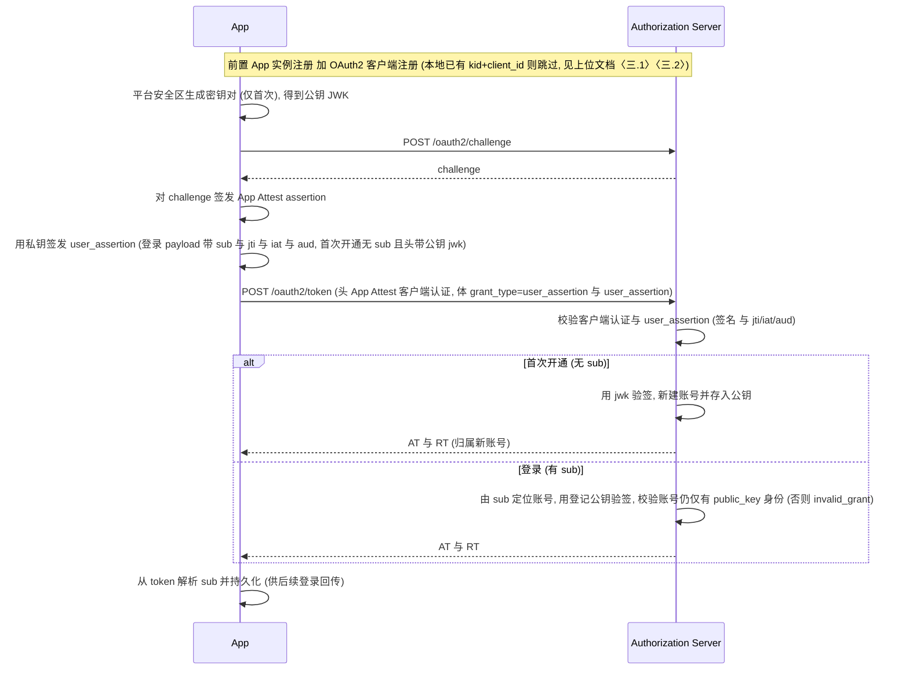

# App Attest 登录 - user_assertion 接入细节

本文档是 [App Attest 登录完整流程](App-Attest-Login.md) 的附录, 描述 **`user_assertion`** 这一 `<user_grant>` 的客户端接入契约: 客户端在设备安全区生成一对非对称密钥, 以私钥签名完成用户证明, 服务端对未知凭证首次即自动开通账号; 用户无需手机号 / 邮箱 / 第三方账号. 总流程、抽象概念、持久化、异常处置、退出登录等见上位文档, 本文只补充该 grant 的细节; 与 [App Attest 实例注册](../../App-Attest-Registration.md)、[Attestation 客户端认证](../../OAuth2-Client-Authentication-%23-Attestation-Based-%23-Apple-App-Attest.md) 保持一致.

> **适用约束**: `user_assertion` 只能用于**未绑定任何其他用户身份**的账号 —— 账号一旦绑定了其他用户身份(手机 / 邮箱 / IdP), 该 grant 即失效(见〈三〉). 因此它通常用于**匿名试用**阶段: 用户先静默开通一个账号试用, 之后再绑定用户身份转为正式账号.
>
> **局限(接入前务必知悉)**: 本方式账号**保证级别低**, 只宜用于试用 / 低敏感场景, 不应用于需要身份保证或承载敏感数据 / 权限之处.
> - **不核验任何用户身份**: 首次开通只验证**客户端**(经 App Attest 证明为合法 App 安装实例), **不核验用户本人** —— 不同于 OTP 验证手机 / 邮箱、IdP 验证用户持有的第三方账号. 这正是称其为"匿名"的原因.
> - **安全性完全系于客户端对私钥的保管, 而服务端无从强制或校验**: 私钥一旦泄露, 持有者即可冒充该身份登录(本方式**无第二认证因素**); 私钥丢失则账号不可恢复(见〈二〉).
>
> 这也正是"账号一旦绑定其他用户身份、本身份即失效"的由来(见〈三〉): 这些身份带来了本方式所缺失的身份核验, 此后应改由该身份登录.
>
> 本文只讲**客户端接入**(协议、请求 / 响应、客户端职责与可观察行为).

---

## 一. 抽象概念在 user_assertion 侧的映射

| 总文档抽象 | user_assertion 落地 |
|---|---|
| `<user_grant>` | `user_assertion`(自定义 grant type) |
| `<credential>` | `user_assertion` —— 客户端私钥签名的 **JWS**(构成见〈二 · 断言形态〉) |
| `identity_type` | `public_key` |
| 唯一标识 | token 的 `sub`: 登录后解析并持久化, 之后每次登录在 `user_assertion` 的 `sub` claim 回传(见〈二〉) |
| CP(Credential Provider) | 用户本人(持有私钥的设备); 私钥由平台安全区(iOS Secure Enclave / Android Keystore / 桌面密钥库)保管, 不可导出 |

落到 `/oauth2/token` 请求矩阵:

| `grant_type` | 请求体关键参数 | 用途 |
|---|---|---|
| `user_assertion` | `user_assertion`(JWS; 登录靠 payload `sub` 定位账号, 首次开通无 `sub`、改附公钥 `jwk`) | **首次使用未知凭证即自动开通**(auto-provision), 已知凭证即登录 |

> 注 1: 与所有 `<user_grant>` 一致, App Attest 客户端认证数据经请求头 (`OAuth-Client-Attestation-*`) 承载; 请求体只放 `grant_type` 与 `user_assertion`. App 实例注册 + OAuth2 客户端注册为前置步骤, 详见上位文档场景二.
>
> 注 2: **勿混淆两种凭证** —— 请求头 `OAuth-Client-Attestation-PoP` / `-Assertion` 是 **App Attest 客户端认证**(证明 *客户端 / App 实例*); 请求体 `user_assertion` 是 **用户凭证**(证明 *用户*, 由 `public_key` 身份的私钥签发). 二者是**两把互相独立的密钥**.
>
> 注 3: `user_assertion` JWS 头里的 `kid`(若带)指向该 `public_key` 身份的公钥, 与 App Attest 的 `kid`(App 实例密钥)分属**不同命名空间**, 仅同名而已.

---

## 二. 凭证模型: `public_key` 身份的密钥

`public_key` 身份的用户凭证是**一把非对称密钥**, 与 App Attest 的 `kid` **完全独立** —— `kid` 只用于客户端认证, 用户凭证是客户端另行生成的**另一把**密钥, 二者互不兼用.

- **多算法**: 不限定单一曲线. 客户端按平台能力选择 **EC P-256 / RSA / Ed25519** 等; 公钥用一个标准 **JWK** 表达(`kty` = `EC` / `RSA` / `OKP`, `crv` = `P-256` / `Ed25519`, `alg` = `ES256` / `RS256` / `EdDSA`, `kid`). 服务端按 JWK 的 `alg` 分派验签, 与算法无关.
- **公钥固定不可改**: 公钥在首次开通时登记, 之后不可修改; 对应私钥一旦丢失, 该账号即无法再登录.
- **登录标识 `sub`**: 首次开通成功后, 从返回的 token 解析 `sub` 并持久化; 之后每次登录在 `user_assertion` 的 `sub` claim 回传, 服务端据此定位账号. `kid` 由客户端生成并置于 `jwk`, 首次开通时随公钥一并上报.
- **私钥**: 客户端平台安全区生成并保管, **不可导出**, 服务端只存公钥.
- **断言形态**: `user_assertion` 是一个 **JWS**. payload **必须**含 **`jti`(每次唯一) + `iat` + `aud`(token 端点)**; **登录时还须含 `sub`**, 首次开通无 `sub`. 服务端会拒绝重复的 `jti`、超出时间窗的 `iat`、不匹配的 `aud`. JWS 头: 登录带 `alg`(+`kid` 可选); 首次开通改带 `alg` + 公钥 `jwk`(含 `kid`). `user_assertion` 用**自己的私钥**签名, 新鲜性由自带 `jti` 保证, 与 App Attest 客户端认证的 `challenge` 各自独立.

### 私钥丢失

公钥注册后不可修改. 因此:

- 私钥与 `sub` 仍在: 用原私钥签名、带回原 `sub` 即可继续登录原账号;
- 私钥或 `sub` 已清除 / 丢失: 只能生成**新密钥对**、无 `sub` 重走开通 —— 服务端**新开一个账号**(新 `sub`), 原账号因私钥不可导出而**无法再登录**(成为孤儿).

> 按〈七〉推荐(默认), 退出登录会连同私钥与 `sub` 一并清除, 故退出即放弃原匿名账号、下次登录得到新身份; 若要退出后仍能找回原账号, 见〈七〉的进阶保留策略.

---

## 三. 约束: 独占账号

`public_key` 身份只能存在于**未绑定任何其他身份**的账号上. 客户端需要知道的行为是:

- 账号一旦绑定了任何**其他用户身份**(手机 / 邮箱 / IdP), **`user_assertion` 登录随即失效**, 服务端返回 `invalid_grant`; 此后该账号改用该身份登录, 数据无损.
- 因此绑定后**无需**删除 `public_key` 身份数据(留着也无法再用于 `user_assertion` 登录).

> 绑定用户身份的流程见 [短信 / 邮箱 OTP 接入细节 · 绑定场景](App-Attest-Login-%23-OTP.md#三-绑定场景-账号追加手机--邮箱绑定).

---

## 四. 登录 / 开通(合并流程, 首用即 auto-provision)

注册与登录合并为一条 `grant_type=user_assertion` 路径: **无 `sub` 即首次开通**(自动建号并绑定该公钥), **有 `sub` 即登录**. 全程叠加 App Attest 客户端认证(真机门槛), 客户端无需区分"注册"与"登录".

对应上位文档[〈三.3 Token 申请与续期〉](App-Attest-Login.md#33-token-申请与续期).



---

## 五. 请求示例

### 5.1 首次开通(头附公钥 `jwk`, 无 `sub`)

```http
POST /oauth2/token
Content-Type: application/x-www-form-urlencoded
OAuth-Client-Attestation-Type: apple_app_attest
OAuth-Client-Attestation-Kid: {kid}
OAuth-Client-Attestation-Challenge: {challenge}
OAuth-Client-Attestation-Assertion: {Base64(App Attest Assertion)}

grant_type=user_assertion
&user_assertion={JWS: 头 alg+jwk(公钥, 含客户端生成的 kid), payload 含 jti/iat/aud, 无 sub}
&scope=openid
```

### 5.2 登录(`sub` 已知)

```http
POST /oauth2/token
Content-Type: application/x-www-form-urlencoded
OAuth-Client-Attestation-Type: apple_app_attest
OAuth-Client-Attestation-Kid: {kid}
OAuth-Client-Attestation-Challenge: {challenge}
OAuth-Client-Attestation-Assertion: {Base64(App Attest Assertion)}

grant_type=user_assertion
&user_assertion={JWS: 头 alg(+kid 可选), payload 含 sub/jti/iat/aud}
&scope=openid
```

---

## 六. `identities` 中 `public_key` 元素结构

作为 `identities` 列表中 `identity_type=public_key` 的元素, 由公共字段(详见[总文档 4.3 用户身份数据](App-Attest-Login.md#43-用户身份数据-identities))与本类型特有的 `jwk` 字段组成. 它**不携带任何 IdP 原生资料字段**(无手机号 / 邮箱 / 昵称 / 头像), 特有字段只有承载公钥的 `jwk`:

```json
{
  "identity_id": "1b9d6bcd-bbfd-4b2d-9b5d-ab8dfbbd4bed",
  "identity_type": "public_key",
  "identifier": "{身份稳定标识}",
  "bound_at": 1778899139687,
  "jwk": {
    "kty": "EC",
    "crv": "P-256",
    "x": "f83OJ3D2xF1Bg8vub9tLe1gHMzV76e8Tus9uPHvRVEU",
    "y": "x_FEzRu9m36HLN_tue659LNpXW6pCyStikYjKIWI5a0",
    "alg": "ES256",
    "kid": "{客户端生成的 kid}"
  }
}
```

| 字段 | 类型 | 含义 |
|---|---|---|
| `identity_id` | string | **公共字段** — 用户身份 ID (UUID) |
| `identity_type` | string | **公共字段** — 固定为 `public_key` |
| `identifier` | string | **公共字段** — 身份稳定标识(只读, 供参考); 登录不需回传它, 登录回传的是 token 的 `sub` |
| `bound_at` | timestamp(3) | **公共字段** — 开通时间, 毫秒级 Unix 时间戳 |
| `jwk` | object | **本类型特有** — 该身份登记的公钥(JWK, 结构见下), 只读下发供客户端核对本地持有的 `kid` |

`jwk` 是一个标准 JWK(RFC 7517), 成员随 `kty` 而异:

| 成员 | 适用 | 含义 |
|---|---|---|
| `kty` | 全部 | 密钥类型: `EC` / `RSA` / `OKP` |
| `crv` | EC / OKP | 曲线: `P-256`(EC) / `Ed25519`(OKP) |
| `x`, `y` | EC / OKP | 曲线点坐标(base64url): EC 有 `x`+`y`, OKP(Ed25519) 只有 `x` |
| `n`, `e` | RSA | 模数与公钥指数(base64url) |
| `alg` | 全部 | 验签算法: `ES256` / `RS256` / `EdDSA` 等; 服务端据此分派验签器 |
| `kid` | 全部 | 客户端生成的密钥标识(首次开通随 `jwk` 上报) |

> `jwk` 只含**公钥**(无私钥), 可安全只读下发.

---

## 七. 客户端持久化

本 grant 侧新增的客户端数据如下(其余见上位文档〈四. 客户端持久化数据〉):

| 数据 | 生命周期 | 是否机密 | 存储位置 |
|---|---|---|---|
| 私钥(密钥材料) | `session` | 是 | 平台安全区(Secure Enclave / Keystore), 由系统托管、不可导出 |
| 私钥的 `kid`(引用) | `session` | 否 | 客户端自定 |
| `sub`(登录回传用) | `session` | 否 | 客户端自定 |

- **推荐(默认)**: 上表三项均按 `session` 处理, 随退出登录一并清除(删除安全区私钥、丢弃其 `kid` 引用与 `sub`). 因此**用户退出登录即意味着该匿名账号数据丢失** —— 下次登录会静默生成新密钥对、无 `sub` 重走开通, 得到一个**新的匿名身份(新 `sub`)**, 原账号在服务端成为孤儿.
- **进阶(可选, 保留原账号)**: 若产品希望退出登录后仍能找回原匿名账号, 可在清除会话数据时**特意保留私钥(不删安全区密钥、留其 `kid` 引用)与 `sub`**(即把这几项当 `persistent` 存); 下次登录用原私钥静默重签 `user_assertion`、带回原 `sub` 即可续用原账号, 数据无损. 这与上位文档〈三.5〉`kid` 被吊销时的“保留私钥 + `sub`”是同一套精细控制.
- **换机 / 私钥物理丢失**: 无论采用哪种策略, 私钥不可导出、不随迁, 换机或私钥丢失后原账号都无法再登录(成为孤儿).

---

## 八. 边界与滥用防护

- **真机门槛**: 开通前必须先完成 App Attest 客户端认证; 服务端可能对开通限频, 客户端应妥善处理相应错误(退避重试, 勿高频刷).
- **`jti` 每次唯一**: `user_assertion` 的 `jti` 由客户端每次新生成, 服务端会拒绝重用(配合 `iat` 时间窗、`aud` 端点绑定防重放); 与 App Attest 的 `challenge` 各自独立.
- **绑定其他身份后失效**: 见〈三〉; 账号升级为正式账号后, `user_assertion` 登录返回 `invalid_grant`, 客户端应引导用户改用该身份登录.
- **不可恢复**: 私钥不可导出、不随迁; 换机 / 私钥丢失, 或按默认在退出登录时清除了私钥与 `sub`, 都无法再登录原账号(见〈七〉).

---

## 九. 相关文档

- [Apple App Attest 登录完整流程文档](App-Attest-Login.md) — 上位文档
- [短信 / 邮箱 OTP 接入细节](App-Attest-Login-%23-OTP.md) — 另一种 `<user_grant>` 落地
- [Apple App Attest 服务发现](../../App-Attest-Discovery.md) / [Apple App Attest 实例注册](../../App-Attest-Registration.md) — App 实例注册前置契约
- [OAuth2 Client Registration - App Attest DYNAMIC](../../OAuth2-Client-Registration-%23-App-Attest-Dynamic.md) — RFC 7591 动态客户端注册
- [Attestation Based Client Authentication (Apple App Attest)](../../OAuth2-Client-Authentication-%23-Attestation-Based-%23-Apple-App-Attest.md) — token 端点的 assertion 客户端认证
- [绑定用户身份](../../APIs-%23-User-Identities-Create.md) / [更新已绑定的用户身份](../../APIs-%23-User-Identities-Update.md) — 绑定用户身份所经接口(`public_key` 只读, 不经更新接口)
- [RFC 7515: JSON Web Signature (JWS)](https://datatracker.ietf.org/doc/html/rfc7515) / [RFC 7517: JSON Web Key (JWK)](https://datatracker.ietf.org/doc/html/rfc7517) — `user_assertion` 凭证的 JWS / JWK(含 `kid` 成员) 规范
