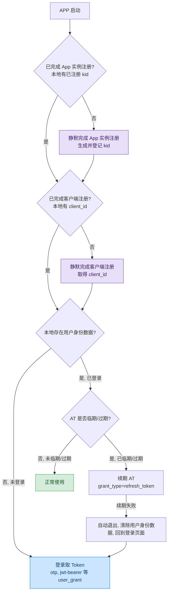
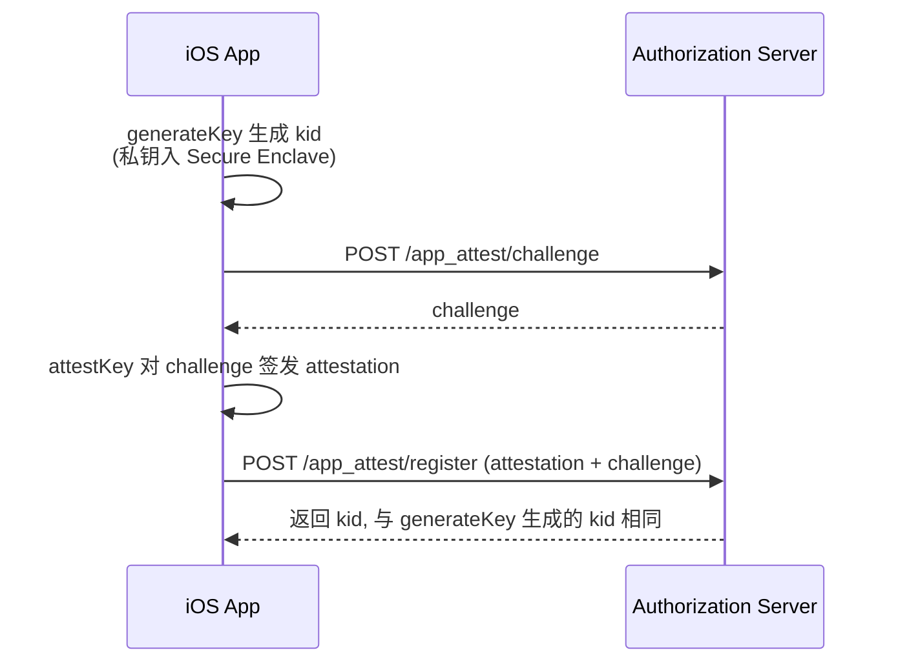
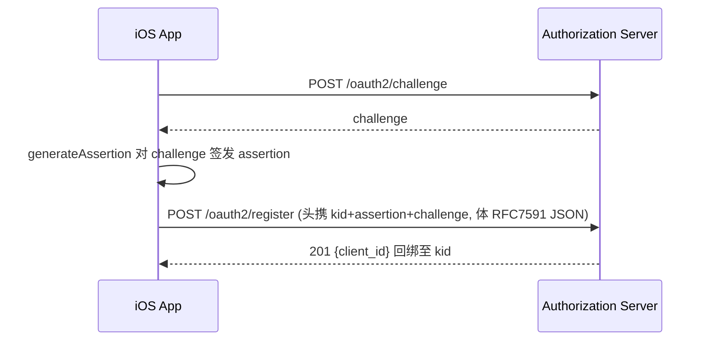
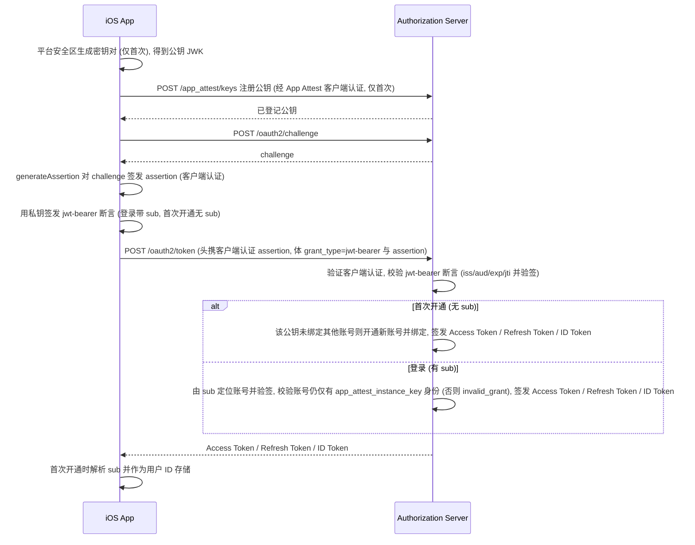
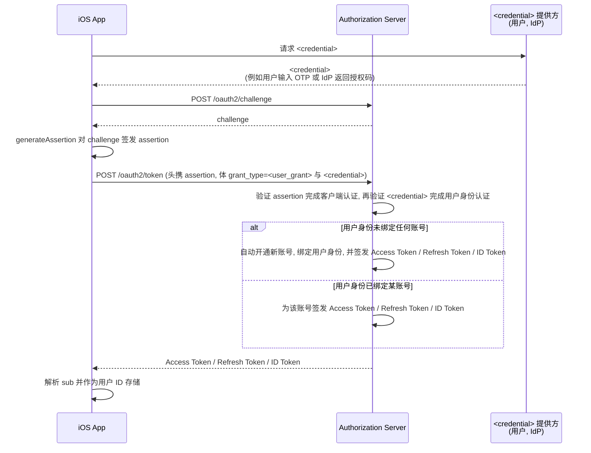
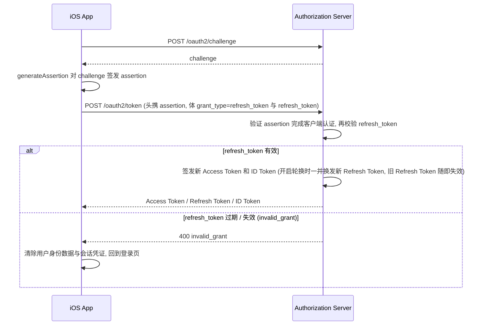
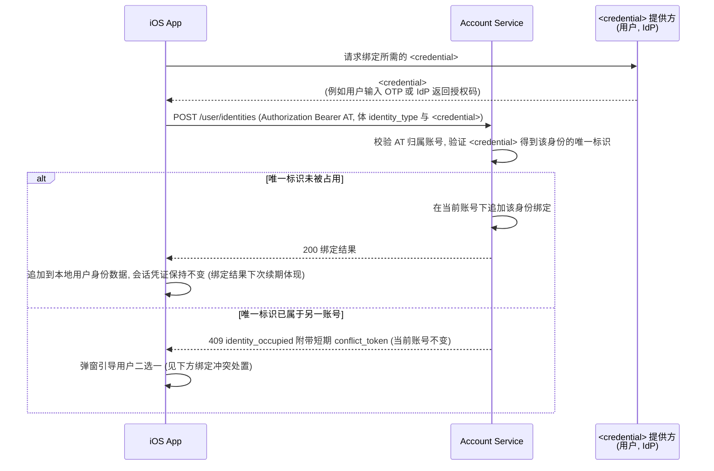

# Apple App Attest 登录完整流程文档

本文档系统地讲述了 iOS App 使用身份认证服务基于 Apple App Attest 完成 App 安装实例证明 + 用户证明, 由服务端签发 Token
的完整流程.

其中用户证明的方式统一以 `<user_grant>` 代指. 它可以是任意一种 OAuth 2.1 Grant Type, 例如:

- 本认证服务支持的标准 OAuth 2.1 Grant Type, 例如 `authorization_code`, `urn:ietf:params:oauth:grant-type:jwt-bearer`
- 本认证服务支持的扩展 Grant Type, 例如 `otp`

具体 `<user_grant>` 的接入细节由各自专项文档描述 (例如[App Attest Login with OTP]).

---

## 零. 流程预览



---

## 一. 核心概念

| 概念            | 说明                                                                                                                                                                                   |
|-----------------|----------------------------------------------------------------------------------------------------------------------------------------------------------------------------------------|
| AT              | **Access Token**<br>OAuth 2.1 访问令牌, 调业务接口与 Account Service 用.                                                                                                               |
| RT              | **Refresh Token**<br>OAuth 2.1 续期令牌. 服务端可配置为**轮换**(refresh token rotation): RT 一次性、每次续期换发新 RT、旧的随即失效. 客户端每次续期后都应以响应中的 RT 覆盖本地保存的. |
| Issuer          | **认证服务**<br>包含两套认证服务<br>- 基于 OAuth 2.1 和 OIDC 协议的用户认证服务<br>- 基于设备证明的 App 安装实例认证服务<br>本文档还会用 `{issuer}` 表示认证服务的基地址.              |
| Account Service | **账号服务**<br>提供 `/user/identities` 等账号身份管理接口.<br>本文档还会用 `{account-service}` 表示用户账号服务的基地址.                                                              |
| `<user_grant>`  | **申请 OAuth Token 时所用的用户证明方式**<br>即一个 `/oauth2/token` 请求的 `grant_type`.                                                                                               |
| `<credential>`  | **`<user_grant>` 所需的用户凭据参数**<br>由对应 grant 的专项文档定义. 例如 `authorization_code` 请求的用户凭据就是授权码 `code`.                                                       |
| `sub`           | **Token 主题**<br>本文档若不特别说明, 则特指用户 AT 的主题, 即用户 ID. 该主题可从 Access Token 或 ID Token 解析获得, 或用 AT 调 `GET /userinfo` 获取.                                  |

> 本文档为了书写方便, 描述接口 URL 时, 默认不带基地址, 例如申请 Token 接口一般会直接写为 `POST /oauth2/token` 或
> `POST {issuer}/oauth2/token`, 实际请求时应在前面拼接用户认证服务基地址.
>
> 基地址可能是域名, 也可能包含路径, 以下地址都是合法的基地址, 客户端接入时应注意兼容.
> - 域名: `https://auth.example.com`
> - 域名 + ContextPath: `https://account.example.com/auth`
> - 域名 + API 版本路径: `https://account.example.com/api/v1`
>
> 以获取用户身份接口 `GET {account-service}/user/identities`为例, 假设账号服务的基地址为
> `https://account.example.com/api/v1`, 则完整的接口 URL 为
> ```http
> GET https://account.example.com/api/v1/user/identities
> ```

---

## 二. 服务端点发现

### 2.1 认证服务端点

#### 2.1.1 用户认证服务端点

遵循 [OpenID Connect Discovery 1.0](https://openid.net/specs/openid-connect-discovery-1_0.html) 规范, 从以下 well-known
端点获取

```
GET {issuer}/.well-known/openid-configuration
```

#### 2.1.2 App 安装实例认证服务端点

属自定义扩展协议, 从以下 well-known 端点动态获取

```
GET {issuer}/.well-known/app-attest-configuration
```

> ⚠️ **两个 challenge 端点勿混**: 用户认证服务和 App 安装实例认证服务各有一个 `challenge` 端点, 但其地址不同, 应分别从各自的
> well-known 端点获取, 切勿混用.
>
> 用户认证服务的端点为 `POST /oauth2/challenge`, 其获取位置为
> ```
> GET {issuer}/.well-known/openid-configuration#challenge_endpoint
> ```
> App 安装实例认证服务的端点为 `POST /app_attest/challenge`, 其获取位置为
> ```
> GET {issuer}/.well-known/app-attest-configuration#challenge_endpoint
> ```

### 2.2 账号服务端点

账号服务不支持 well-known 端点, 其端点地址都是固定的, 接入方根据接口文档拼接上 `{account-service}` 即可.

> ⚠️ **认证服务和账号服务合并部署时的注意事项**: 认证服务和账号服务支持合并部署, 即 `{issuer}` 和 `{account-service}`
> 可能相同, 但接入时仍应维护两个相互独立的配置项, 防止其中某一个被单独修改.

---

## 三. 接入步骤

### 3.1 App 实例注册

App 安装实例首次启动时利用 Apple App Attest 的 Attestation 向认证服务证明自己是一个安装在真实 iOS 设备上的 App.
这一机制可以确保服务端拿到未经篡改的可信 teamId 和 bundleId. 注册完成后, App 后续可以使用 Assertion 快速声明自己的身份,
例如用 Assertion 作为 RFC 7591 OAuth Client 动态注册请求的认证凭据.
完整契约见 [Apple App Attest 实例注册](../../App-Attest-Registration.md).

请求示例:

```http
POST /app_attest/register
App-Attest-Attestation: {Base64(Attestation Object)}
App-Attest-Challenge: {challenge}
```

时序图:



### 3.2 OAuth 客户端注册

App 安装实例利用 Apple App Attest 的 Assertion
按 [RFC 7591 OAuth 2.0 Dynamic Client Registration Protocol](../../OAuth2-Client-Registration-%23-App-Attest-Dynamic.md)
将自己注册为一个 OAuth Client, 为后续申请 Token 做准备.

请求示例:

```http
POST /oauth2/register
Content-Type: application/json
App-Attest-Kid: {kid}
App-Attest-Challenge: {challenge}
App-Attest-Assertion: {Base64(Assertion Object)}

{
  "client_name": "com.example.app",
  "grant_types": ["otp", "urn:ietf:params:oauth:grant-type:jwt-bearer", "refresh_token"],
  "scope": "openid profile",
  "token_endpoint_auth_method": "attest_appattest_client_auth"
}
```

> ⚠️ 若需支持 3.3.1 的匿名试用, 需要在 grant_types 中包含 `urn:ietf:params:oauth:grant-type:jwt-bearer`.

时序图:



> ⚠️ 3.1 中 `generateKey` 产生的 `kid` 和 3.2 中 `POST /oauth2/register` 接口返回的 `client_id` 的生命周期应该都是 App
> 安装实例级的. 即不随用户退出登录而清除, 仅在 App 被卸载或 kid 被吊销时才清除.

### 3.3 Token 申请与续期

App 实例注册与客户端注册完成后 (本地已持有 `kid` 和 `client_id`),
使用 [OAuth2 Client Attestation-Based Authentication with Apple App Attest](../../OAuth2-Client-Authentication-%23-Attestation-Based-%23-Apple-App-Attest.md)
作为 OAuth Client 认证机制通过 `POST /oauth2/token` 接口使用不同的 `grant_type`
完成 Token 申请或续期.

目前支持的 `grant_type`

| Grant Type                                    | Credential 参数      | 用途                            | 参考文档                                        |
|-----------------------------------------------|----------------------|---------------------------------|-------------------------------------------------|
| `otp`                                         | `otp_ticket` + `otp` | 邮箱 / 短信 验证码登录          | [App Attest Login with OTP]                     |
| `refresh_token`                               | `refresh_token`      | AT 续期                         | [The OAuth 2.1 Authorization Framework (Draft)] |
| `urn:ietf:params:oauth:grant-type:jwt-bearer` | `assertion`          | 匿名试用                        | [App Attest Login with JWT Bearer]              |
| `conflict_token`                              | `conflict_token`     | 绑定冲突时一键切换到已绑定账号  | (本期不实现)                                    |
| 其他标准 OAuth Grant                          | 标准参数             | 标准 Token 申请, App 暂时用不到 | [The OAuth 2.1 Authorization Framework (Draft)] |

> ⚠️ **注意事项:**
> - 本认证服务支持 OIDC, 请务必在 `scope` 参数中指定 `openid` 向认证服务申请 ID Token, 用于解析必要的用户数据, 例如
> `sub`.
> - `urn:ietf:params:oauth:grant-type:jwt-bearer` 为了书写方便, 下文会简写为 `jwt-bearer`.

#### 3.3.1 通过 `jwt-bearer` 进行匿名试用

用户认证服务支持以标准 `jwt-bearer` grant 完成一种低门槛的匿名登录: App 在设备安全区静默生成一对非对称密钥, 先把**公钥注册**到服务端, 之后每次登录用**私钥签发 jwt-bearer 断言**换取 Token. 此方式安全性相对较低, 并不核验用户真实身份(仅证明持有私钥), 仅适用于**未绑定其他用户身份**的账号; 账号一旦绑定其他用户身份, 该方式登录即失效(见 3.4).

> 公钥注册端点、断言完整格式与边界见 [App Attest Login with JWT Bearer]. 本节只给出取 Token 的概览.

第一步 · **注册公钥**(一次性): 客户端向公钥注册端点上报公钥, 经 App Attest 客户端认证(端点从 App 安装实例认证服务的 `keys_endpoint` 发现, 默认 `/app_attest/keys`; 凭据用 `App-Attest-*` 请求头承载):

```http
POST /app_attest/keys
Content-Type: application/json
App-Attest-Kid: {kid}
App-Attest-Challenge: {challenge}
App-Attest-Assertion: {Base64(Assertion Object)}

{ "kty": "EC", "crv": "P-256", "x": "...", "y": "...", "alg": "ES256", "kid": "{你为这把公钥选的 kid}" }
```

第二步 · **取 Token**(jwt-bearer 登录): 首次登录断言**不带 `sub`**, 服务端自动开通匿名账号并在 Token 里带回 `sub`(客户端解析并持久化); 之后登录**带 `sub`**. RT 可用时优先走 3.3.3 续期, RT 失效再用私钥重签断言:

> 带 `sub` 登录时, `kid` **必填**且必须是该账号**已持有**的那把公钥. 指向别的公钥一律 `invalid_grant`, 服务端**不会**把它追加到该账号上 —— 因为 `sub` 就是用户 ID、随每个 AT 下发, 不是机密, 不能拿"知道 `sub`"当账号控制权. 故一个账号只有一把公钥, 私钥丢失即账号不可恢复. 详见 [App Attest Login with JWT Bearer] 的〈六〉.

```http
POST /oauth2/token
Content-Type: application/x-www-form-urlencoded
App-Attest-Kid: {kid}
App-Attest-Challenge: {challenge}
App-Attest-Assertion: {Base64(Assertion Object)}

grant_type=urn:ietf:params:oauth:grant-type:jwt-bearer
&assertion={JWS: 头 alg + kid, payload 含 iss/sub/aud/exp/iat/jti, 首次开通无 sub}
&scope=openid
```

时序图:



> ⚠️ **注意区分 `App-Attest-Kid` 的 `kid` 和 jwt-bearer 断言中的 `kid`.**
>
> 这是两把不同密钥的 `kid`, 二者的值不相同:
> - `App-Attest-Kid` 的 kid 是 Apple App Attest 的 kid, 用于生成 Apple App Assertion 完成客户端身份认证;
> - jwt-bearer 断言的 kid 是 App 自行生成、已注册到服务端的非对称密钥的 kid, 用于签发断言完成用户身份认证. 它**由客户端在注册公钥时自行指定**(写在提交的 JWK 里, 建议用 UUID), 服务端不派生也不改写, 登录时需原样回传.

#### 3.3.2 使用正式 `<user_grant>` 申请 Token

本节讲述如何通过除 3.3.1 匿名试用的 `jwt-bearer` 之外的正式 `<user_grant>` 完成真正的用户身份认证并申请 Token.

这些正式的 `<user_grant>` 与匿名试用的 `jwt-bearer` 最关键的区别是: 正式身份认证需要用户参与以证明其身份, 比如通过输入 OTP
证明其持有接收 OTP 的手机或邮箱.

请求示例:

```http
POST /oauth2/token
Content-Type: application/x-www-form-urlencoded
App-Attest-Kid: {kid}
App-Attest-Challenge: {challenge}
App-Attest-Assertion: {Base64(Assertion Object)}

grant_type=<user_grant>
&<credential>
&scope=openid
```

时序图:



#### 3.3.3 使用 RT 续期 AT

请求示例:

```http
POST /oauth2/token
Content-Type: application/x-www-form-urlencoded
App-Attest-Kid: {kid}
App-Attest-Challenge: {challenge}
App-Attest-Assertion: {Base64(Assertion Object)}

grant_type=refresh_token
&refresh_token={refresh_token}
&scope=openid
```

时序图:



> 💬 **离线的判定**: "在线"指客户端有可用的 RT 来续期 AT. 但由于 RT 没有记录过期时刻, 所以客户端无法直接判定 RT 是否可用,
> 一个比较简单的办法就是在 AT 过期时直接用 RT 去尝试续期一次, 续期失败即视为离线.

### 3.4 绑定用户身份

一个账号可绑定多个用户身份 (手机 / 邮箱 / IdP 账号如 Google、微信 等). 匿名试用账号绑定其他用户身份后即
**升级为正式账号**; 正式账号也可继续追加其他身份.

绑定走账号服务接口 `POST /user/identities` (携 AT), 它只为 **当前 AT 对应的账号**追加一条绑定, **不下发新
AT、也不改账号**; 绑定结果体现在后续会话 (下次续期时服务端返回反映已绑定身份的新 AT).

> ⚠️ 绑定其他用户身份后, 该账号的 `jwt-bearer` 登录 **随即失效** (返回 `invalid_grant`), 改由该身份登录, 数据无损;
> 无需删除原 `app_attest_instance_key` 身份数据.

请求示例:

```http
POST /user/identities
Authorization: Bearer {access_token}
Content-Type: application/x-www-form-urlencoded

identity_type=<identity_type>
&<credential>
```

`<identity_type>` 为要绑定的身份类型 (如 `phone` / `email` / `wechat` / `google`), `<credential>` 为该身份所需的用户凭据
(与同类型登录一致, 如 `phone` / `email` 用 `otp_ticket` + `otp`). 各身份类型的具体绑定参数见专项文档
(如 [OTP 接入细节 · 绑定场景](App-Attest-Login-%23-OTP.md#三-绑定场景-账号追加手机--邮箱绑定)、[绑定用户身份接口](../../APIs-%23-User-Identities-Create.md)).

时序图:



**绑定冲突处置**: 若目标身份的 `唯一标识` 在服务端已属于 **另一个账号**, `POST /user/identities` 返回
`409 identity_occupied` 并附带短期 `conflict_token`(固定不改变当前账号). 客户端应弹窗引导用户二选一:

- **方式 A — 换一个未被占用的身份**(现行): 用户重新取得新的 `<credential>` 再调 `POST /user/identities`,
  绑定成功后当前账号升级为正式账号.
- **方式 B — 一键切换到该身份已绑定的账号**(本期不实现): 用 `conflict_token` 走 `/oauth2/token`
  (`grant_type=conflict_token`) + assertion 请求头切换至 `账号_2`; APP 清除本地用户数据 (用户身份数据 + 会话凭证)但 **保留
  App 实例级 `kid` + `client_id`**, 服务端返回 `账号_2` 的 AT/RT (`kid` 仅作客户端认证, 不绑定账号). 原 `账号_1`
  在服务端保留但自身无任何用户身份, 成为 **孤儿账号**(试用数据留在服务端、客户端无法再访问, 且不迁移到 `账号_2`). 这是
  **账号切换而非数据合并**, 落地后应在调用前明确告知用户.

### 3.5 异常处置: `kid` 被吊销

触发 Apple 风控时服务端会吊销 `kid`, 此后所有携该 `kid` assertion 的请求 (取 Token、续期) 都会失败. 客户端应把失效的
`kid` + `client_id` 与会话数据一并清除. 下次启动时按本文档的完整流程重新注册 App 实例和 OAuth Client, 并引导用户重新登录.

> ⚠️ 对于匿名试用账号由于清空会话数据会把 `jwt-bearer` 登录的私钥也一并清除, 所以原账号将不可恢复. 如果想保留原账号,
> 也有办法: 清会话数据时保留该私钥和匿名账号的 `sub`, 下次启动时按本文档的完整流程重新注册 App 实例和
> OAuth Client、**并用原私钥重新登记一次公钥**(见 [App Attest Login with JWT Bearer] 的〈四〉)后, 用原私钥静默重签
> `jwt-bearer` 断言(带回原 `sub`)即可重新取 AT (无需用户参与), 账号数据无损.
>
> ⚠️ 但若连私钥也丢了(重装 / 换机使安全区密钥消失), 仅保下 `sub` 也**无法恢复**: 服务端不允许用一把新公钥接管既有账号
> —— 那等于把"知道 `sub`"当成账号凭据, 而 `sub` 随每个 AT 下发、并非机密. 原账号只能成为孤儿.
> 见 [App Attest Login with JWT Bearer] 的〈六〉.

---

## 四. 客户端持久化数据

客户端持久化的数据分三类, 每类按两个维度定性, 由此决定存储位置与清理时机:

- **生命周期**: `session`(退出登录 / 续期失败时清除, 见〈五〉) 或 `persistent`(仅"抹掉所有数据"或注册信息失效时才清除).
- **是否机密**: 机密数据 (bearer 凭据、用户 PII)**强制存 Keychain**, 禁止明文存 `UserDefaults` / `plist`(越狱设备可读取);
  非机密数据 (标识符类, 如 `kid` / `client_id` —— 签名私钥不可导出, 泄露不构成风险)**不强制存储位置**, 由客户端自选.

| 数据类           | 生命周期     | 是否机密 | 存储位置           |
|------------------|--------------|----------|--------------------|
| App 实例注册信息 | `persistent` | 否       | 不强制(客户端自定) |
| 会话凭证         | `session`    | 是       | **Keychain**       |
| 用户身份数据     | `session`    | 是       | **Keychain**       |

### 4.1 App 实例注册信息 (App Instance Enrollment)

App 实例注册与客户端注册的产物, **归属 App 实例、独立于用户身份数据**.

```json
{
  "kid": "<base64-url-encoded-kid>",
  "client_id": "<base64-url-encoded-client-id>",
  "iat": "2026-05-10T12:34:56Z"
}
```

| 字段        | 类型   | 含义                                                                                 |
|-------------|--------|--------------------------------------------------------------------------------------|
| `kid`       | string | **Apple App Attest Key Identifier**, App 实例注册(`/app_attest/register`)后本地持有  |
| `client_id` | string | **per-KEY OAuth2 客户端标识**, 客户端注册(`/oauth2/register`)返回, 与 `kid` 一一绑定 |
| `iat`       | date   | **Apple App Attest Key 的生成时间(Issued At)**                                       |

### 4.2 会话凭证 (Session Credentials)

> 下例为 `POST /oauth2/token` 成功响应结构 (下划线风格, APP 可自行映射为驼峰). 客户端把 token 值原样保存, 并在
> **收到响应的当下**据 `expires_in` 换算出 AT 绝对过期时刻一并存下; `token_type` / `scope` 无需持久化.

```json
{
  "access_token": "eyJhbGciOiJSUzI1NiIsInR5cCI6IkpXVCJ9...",
  "token_type": "Bearer",
  "expires_in": 3599,
  "refresh_token": "8xLOxBtZp8eNq7WmY3sQ1vC5yR2tG4zH",
  "scope": "openid profile",
  "id_token": "eyJhbGciOiJSUzI1NiIsInR5cCI6IkpXVCJ9..."
}
```

客户端持久化字段:

| 字段                      | 类型   | 含义                                                                                                                                                    |
|---------------------------|--------|---------------------------------------------------------------------------------------------------------------------------------------------------------|
| `access_token`            | string | 业务接口凭证(AT)                                                                                                                                        |
| `access_token_expires_at` | date   | AT 绝对过期时刻, **收到响应时**据 `expires_in` 换算记录, 用于临期判断                                                                                   |
| `refresh_token`           | string | 续期凭证(RT). 每次续期后以响应中的新 RT 覆盖本地保存(服务端开启**轮换**时旧 RT 随即失效)                                                                |
| `id_token`                | string | **OIDC ID Token**(JWT), 承载用户 profile 声明(`sub` / `name` / `picture` 等). 需 `scope` 含 `openid`; 用户档案从此解析, 或用 AT 调 `GET /userinfo` 获取 |

> **用户 profile 不在本文档统一持久化**: 业务方可能有自己的 profile 服务, 故本文不定义 profile 结构. 与用户档案相关的信息由
> `id_token` 承载 (或经 `GET /userinfo` 获取), 客户端按需处理.

### 4.3 用户身份数据 (Identities)

> 示例采用下划线风格 (与接口返回一致), APP 可自行映射为驼峰.

```json
[
  {
    "identity_id": "6ba7b810-9dad-11d1-80b4-00c04fd430c8",
    "identity_type": "email",
    "subject": "3a4b5c6d7e8f9a0b1c2d3e4f5a6b7c8d9e0f1a2b3c4d5e6f7a8b9c0d1e2f3a4b",
    "bound_at": 1778899139687,
    "email": "u**r@e*****e.com"
  }
]
```

| 字段                 | 类型         | 含义                                                                                                                                                                     |
|----------------------|--------------|--------------------------------------------------------------------------------------------------------------------------------------------------------------------------|
| `$`                  | list         | **账号绑定的用户身份(手机 / 邮箱 / Apple / Google / app_attest_instance_key 等)列表**(根数组). 用 AT 调 `GET /user/identities` 获取; 每个元素含下述公共字段, 各类型可追加自身原生字段 |
| `$[*].identity_id`   | string       | **公共字段 — 用户身份 ID**, 服务端生成的 UUID                                                                                                                            |
| `$[*].identity_type` | string       | **公共字段 — 用户身份类型标识**, 如 `apple` / `google` / `phone` / `email` / `app_attest_instance_key`                                                                                |
| `$[*].subject`       | string       | **公共字段 — 该身份的稳定唯一标识**, 不同 `identity_type` 各自定义其含义(如 `phone` / `email` 为原值的哈希)                                                              |
| `$[*].bound_at`      | timestamp(3) | **公共字段 — 首次绑定时间**, 毫秒级 Unix 时间戳                                                                                                                          |

> `identities` 中每个元素 = 公共字段 (`identity_id` / `identity_type` / `subject` / `bound_at`) + 该类型的原生字段.
> 原生字段因 `identity_type` 而异, 由各自专项文档定义 —— 例如 [OTP 接入细节][App Attest Login with OTP] 的 `phone` /
> `email` 元素、[JWT Bearer 接入细节][App Attest Login with JWT Bearer] 的 `app_attest_instance_key` 元素.

---

## 五. 退出登录

退出登录即清除本地所有生命周期为 `session` 的数据 (会话凭证与用户身份数据), 其余 `persistent` 数据 (App 实例注册信息)
保留.

---

## 六. 相关文档

- [The OAuth 2.0 Authorization Framework]
- [The OAuth 2.1 Authorization Framework (Draft)]
- [OAuth 2.0 Attestation-Based Client Authentication (Draft)]
- [App Attest Login with OTP]
- [App Attest Login with JWT Bearer]
- [Apple App Attest 服务发现](../../App-Attest-Discovery.md) — `/.well-known/app-attest-configuration` 端点发现
- [Apple App Attest 实例注册](../../App-Attest-Registration.md) — `POST /app_attest/register` 完整契约
- [OAuth2 Client Registration - App Attest DYNAMIC](../../OAuth2-Client-Registration-%23-App-Attest-Dynamic.md) — RFC
  7591 动态客户端注册契约
- [Attestation Based Client Authentication (Apple App Attest)](../../OAuth2-Client-Authentication-%23-Attestation-Based-%23-Apple-App-Attest.md) —
  token 端点的 assertion 客户端认证
- [绑定用户身份](../../APIs-%23-User-Identities-Create.md) — `POST /user/identities` 契约
- [OAuth2 Token Grant - App Attest](../../OAuth2-Token-Grant-%23-App-Attest.md) — 已废弃 `app_assertion` grant 的兼容说明

[The OAuth 2.0 Authorization Framework]: https://www.rfc-editor.org/rfc/rfc6749.html
[The OAuth 2.1 Authorization Framework (Draft)]: https://www.ietf.org/archive/id/draft-ietf-oauth-v2-1-16.txt
[OAuth 2.0 Attestation-Based Client Authentication (Draft)]: https://datatracker.ietf.org/doc/html/draft-ietf-oauth-attestation-based-client-auth-11
[App Attest Login with OTP]: App-Attest-Login-%23-OTP.md
[App Attest Login with JWT Bearer]: App-Attest-Login-%23-Jwt-Bearer.md

